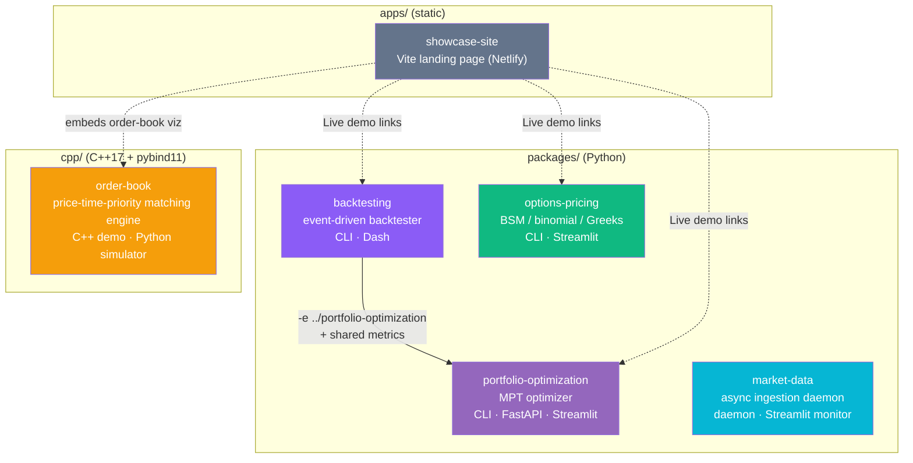
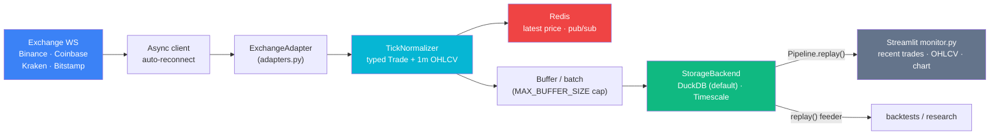
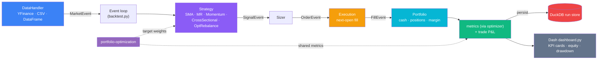
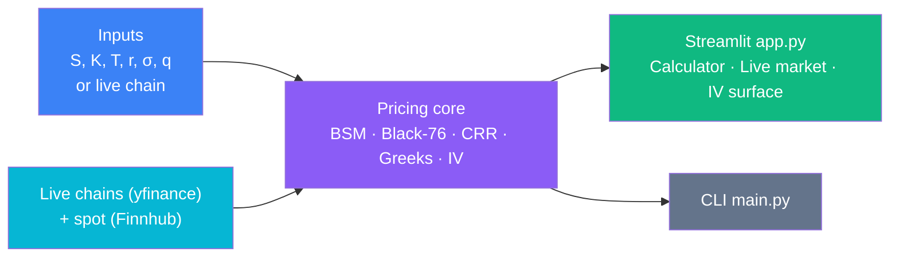
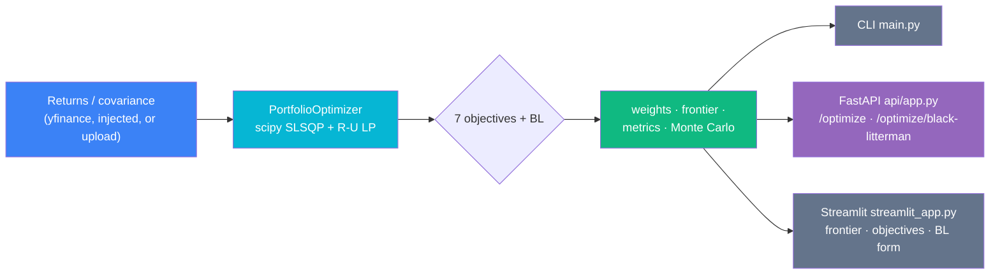
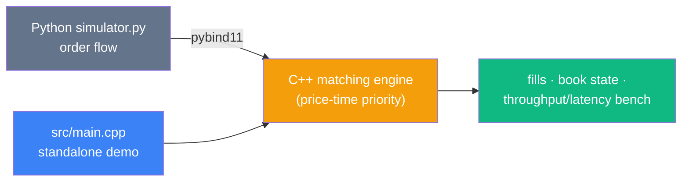
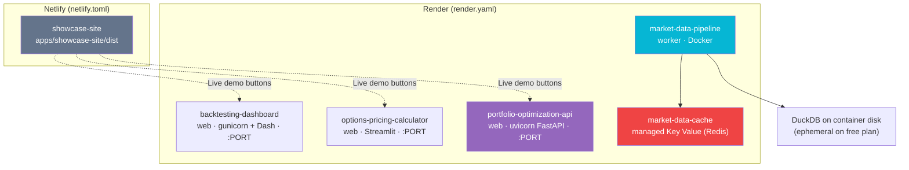

# Architecture

How the quant monorepo fits together — the projects, the one cross-package
dependency, the data flow through each runnable app, and where it deploys. This
is the "read me first if you just joined the team" document.

All diagrams below are [Mermaid](https://mermaid.js.org/) and render natively on
GitHub (no build step). For a clone-and-run walkthrough see
[`docs/getting-started.md`](docs/getting-started.md); for conventions and the
agent registry see [`AGENTS.md`](AGENTS.md).

---

## System context

Five independent projects plus a static showcase site live in one repo. Only
**one** cross-package dependency exists: the backtester depends one-way on the
portfolio optimizer (it drives the optimizer for walk-forward rebalancing and
shares the optimizer's `metrics` module as the single source of truth for
Sharpe / Sortino / drawdown). Everything else is standalone.

> **The one contract that matters:** `packages/backtesting` imports the
> optimizer (`OptimizationRebalanceStrategy`) and re-uses its `metrics` module.
> In the monorepo this is a co-located editable install (`-e
> ../portfolio-optimization` in the backtester's `requirements.txt`), so it
> resolves identically locally, in CI, and on Render — no git-URL install.
> `make setup` installs the optimizer **first** for exactly this reason.

---

## Per-package responsibilities & entry points

| Package | Responsibility | Library / core | Entry points | Popular equivalent |
|---|---|---|---|---|
| `packages/portfolio-optimization` | MPT optimization (frontier, 7 objectives, HRP, Black-Litterman, Ledoit-Wolf, Monte Carlo) | `portfolio_optimization_engine/` (numpy/pandas/scipy) | `main.py` (CLI) · `api/app.py` (FastAPI) · `streamlit_app.py` (Streamlit) | PyPortfolioOpt, riskfolio-lib, skfolio, cvxpy |
| `packages/backtesting` | Event-driven, next-open-fill multi-asset backtester with walk-forward MPT rebalancing | `src/` (pandas, DuckDB) | `main.py` (CLI) · `dashboard.py` (Dash) | backtrader, vectorbt, backtesting.py, zipline-reloaded |
| `packages/market-data` | Async daemon: WS trades → normalize → Redis cache → DuckDB/Timescale store; `replay()` feeder | `src/` (asyncio, websockets, redis) | `main.py` (daemon) · `monitor.py` (Streamlit) | cryptofeed, ccxt-pro, ArcticDB |
| `packages/options-pricing` | Vanilla options: BSM, Black-76, CRR binomial (EU+AM), Greeks, IV solver, live chains | `src/` (NumPy/SciPy) | `main.py` (CLI) · `app.py` (Streamlit) | QuantLib, py_vollib, mibian |
| `cpp/order-book` | C++17 price-time-priority limit-order-book matching engine + Python simulator via pybind11 | `src/*.cpp`, `python/orderbook/` | `src/main.cpp` (C++ demo) · `python/simulator.py` | ABIDES, mbt-gym |
| `apps/showcase-site` | Static portfolio landing page presenting all projects | `index.html`, `src/main.js` (Vite) | `npm run dev` / `npm run build` | — |

Each Python package owns its own `requirements.txt` / `pyproject.toml`, test
suite, `README.md`, and `CONTRIBUTING.md`. Repo-wide tooling (LICENSE,
ruff/mypy config, pre-commit, CI, `render.yaml`, `netlify.toml`, the root
`Makefile`, `docker-compose.yml`, `.devcontainer/`) is unified at the root.

---

## Data flow per runnable app

### market-data — ingestion daemon + read-only monitor

The daemon (`main.py`) is headless and write-side; the Streamlit `monitor.py` is
a **read-only reader of the store** (it never opens a WebSocket).

The monitor builds the **same** `StorageBackend` the daemon uses (via
`build_storage`) and pulls history through `Pipeline.replay()`. On a fresh clone
the DuckDB file is usually empty, so it synthesizes a deterministic seeded
sample and shows a clear "sample data" banner — it always renders something.

### backtesting — event loop + Dash dashboard

### options-pricing — pricing core + Streamlit app

### portfolio-optimization — optimizer with three front ends

The Streamlit app and FastAPI demo are **demo surfaces** — they never reimplement
the math; every result flows through the same public API (the injected-returns
contract the backtester uses), so the cross-package contract can't drift.

### order-book — C++ engine driven from Python

`python/simulator.py` drives the **real** compiled C++ engine through the
`_orderbook` pybind11 module (re-exported via `python/orderbook/`) — not a Python
re-implementation. `benchmarks/bench.py` measures the engine through the same
binding.

---

## Deployment topology

Netlify cannot host backends/daemons, so the repo uses a **Netlify + Render**
hybrid. The static showcase goes to Netlify; the runnable Python apps go to
Render. This reconciles with the committed [`netlify.toml`](netlify.toml) and
[`render.yaml`](render.yaml).

| Service (`render.yaml`) | Type | Root | Start | Health |
|---|---|---|---|---|
| `backtesting-dashboard` | web (python) | `packages/backtesting` | `gunicorn dashboard:server` | `/` |
| `options-pricing-calculator` | web (python) | `packages/options-pricing` | `streamlit run app.py` | `/_stcore/health` |
| `portfolio-optimization-api` | web (python) | `packages/portfolio-optimization` | `uvicorn api.app:app` | `/health` |
| `market-data-pipeline` | worker (docker) | `packages/market-data` | `Dockerfile` | — |
| `market-data-cache` | keyValue (Redis) | — | — | — |

Deploy notes that keep every demo runnable with **no external database**:

- **market-data worker** defaults to `STORAGE_BACKEND=duckdb` and needs only the
  managed Key Value (Redis) plus the container's writable disk (ephemeral on the
  free plan). External TimescaleDB is optional (`STORAGE_BACKEND=timescale` +
  `DATABASE_URL`).
- **portfolio FastAPI demo** optimizes a returns matrix POSTed by the caller —
  zero network fetch, deterministic by construction.
- **options** and **backtesting** apps fetch live data (yfinance / Finnhub) but
  ship bundled fixtures and `*_OFFLINE` flags so cloud egress limits never
  hard-fail the demo. See each package's `DEPLOY.md`.
- The Netlify build runs `cd apps/showcase-site && npm ci && npm run build` and
  publishes `apps/showcase-site/dist`.

The C++ order book is **not** a hosted service — a static visualization is
embedded in the showcase (a WASM compile is future work).

---

## Design decisions

- **Why a monorepo?** As of 2026-06-01 the five projects (formerly separate
  repos) live in one repo. The deciding factor is the backtester → optimizer
  dependency: co-locating them means the editable install resolves locally, in
  CI, and on Render without a git-URL dependency, and one root toolchain
  (LICENSE, ruff/mypy, pre-commit, CI, deploy blueprints) covers everything. Each
  project still keeps its own README / requirements / tests so it reads as a
  self-contained library.
- **Why DuckDB as the demo default?** TimescaleDB needs a hosted PostgreSQL +
  extension that Render's free tier can't provide. A `StorageBackend` protocol
  lets the market-data daemon write the **same** normalized schema to either an
  embedded DuckDB file (no external DB, no network) or Timescale. DuckDB is the
  default so the pipeline — and its monitor — run end-to-end on a fresh clone and
  on free cloud infra with zero setup. The backtester likewise persists every run
  to an embedded DuckDB so strategy comparison is just SQL.
- **Why the editable cross-package install?** The backtester needs the live
  optimizer source (for `OptimizationRebalanceStrategy`) and must share the exact
  `metrics` definitions. `-e ../portfolio-optimization` keeps a single source of
  truth — a metrics-parity test enforces that the backtester's inline statistics
  agree with the standalone `metrics` functions, so the contract can't drift
  silently.
- **Why one shared `.venv`?** `make setup` builds a single root `.venv` and
  installs the optimizer first, then the rest. One interpreter for all packages
  keeps the editable cross-package link valid and makes `make run-*` / `make test`
  work from any directory.
