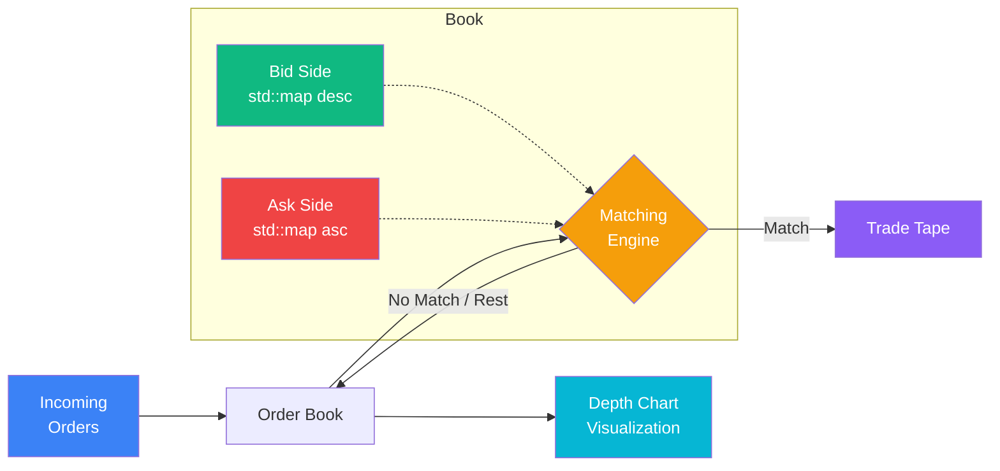

# Order Book Simulator & Matching Engine

[](https://github.com/nicholim/quant-lab/actions/workflows/ci.yml)
[](LICENSE)
[](https://en.cppreference.com/w/cpp/17)
[](https://www.python.org/)
[](.clang-format)
[](https://docs.astral.sh/ruff/)

A real **price-time-priority limit order book matching engine** in C++17, with a Python layer for
order-flow simulation and depth-of-book visualization.

## Why this exists

Most "order book" libraries in the quant-research ecosystem are *model-based* — they approximate
fills with stochastic intensity functions (e.g. Avellaneda-Stoikov) rather than actually matching
orders. This project does the opposite: it is a deterministic matching engine that matches every
incoming order against resting liquidity using the exact **price-time priority** semantics real
exchanges use (best price first, FIFO within a price level), including partial fills that sweep
multiple price levels. The C++ core keeps the hot path fast and allocation-light; the Python layer
handles the things Python is good at — generating order flow and plotting the book.

## Architecture

The system is split in two: a C++17 matching-engine core (the deterministic, performance-sensitive
part) and a Python visualization/simulation layer (order-flow generation and charting). The layers
are decoupled — Python does not bind into the C++ core; it generates order flow (JSON) and renders
book/trade state.



**Matching semantics (price-time priority):**

1. An incoming order is matched against the opposite side, **best price first**.
2. Within a price level, resting orders are filled **in arrival order (FIFO)**.
3. A `LIMIT` order matches only at prices no worse than its limit; any unfilled remainder **rests**
   in the book. A `MARKET` order matches until filled or the book is exhausted (no remainder rests).
4. Incoming orders can **partially fill** across multiple levels; resting orders track
   `remaining_quantity` independently.

### C++ core vs. Python layer

| Layer | Responsibility | Key files |
|-------|----------------|-----------|
| **C++17 core** | `OrderBook` (single symbol) + `MatchingEngine` (multi-symbol router); matching, partial fills, cancel/modify, depth queries | `include/`, `src/order_book.cpp`, `src/matching_engine.cpp` |
| **Demo** | Scripted scenario: place → match → cancel → sweep, prints book state | `src/main.cpp` |
| **Python viz** | Depth chart, trade tape, spread-over-time (matplotlib) | `python/visualizer.py` |
| **Python sim** | Random order-flow generator with a price random walk → `orders.json` | `python/simulator.py` |

## Features

- **Price-time priority** — best-price-first, FIFO-within-level matching, as used by major exchanges
- **Order types** — `MARKET` and `LIMIT` orders, with partial-fill support across price levels
- **Order management** — add, cancel, and modify resting orders
- **Book depth** — bid/ask depth at configurable levels, best bid/ask, spread, volume-at-price
- **Multi-symbol** — `MatchingEngine` routes to a separate `OrderBook` per symbol
- **Python visualization** — depth charts, trade tape, and spread analysis

> **Scope note:** order types are `MARKET` and `LIMIT` only. Stop / stop-limit / iceberg / IOC / FOK
> orders are intentionally **not** implemented — see [Roadmap](#roadmap).

## Technical highlights

- **Correct price-time priority** — `std::map` gives sorted price levels, `std::list` gives FIFO
  within each level, matching how exchange order books actually work.
- **Partial fill handling** — incoming orders match across multiple price levels; resting orders
  track `remaining_quantity` independently.
- **O(1) order lookup for cancel** — a `std::unordered_map` indexes order ID → (side, price) so
  cancellation does not scan the book.
- **RAII / no raw pointers** — no manual `new`/`delete`; allocations stay inside STL containers.
- **Const-correct API** — read-only methods (`get_best_bid`, `get_depth`, …) are `const`.

## Tech stack

- **C++17** — core matching engine (STL: `std::map`, `std::list`, `std::chrono`)
- **CMake** (≥ 3.16) — build system; GoogleTest pulled via `FetchContent`
- **Python 3.10+** — visualization and market simulation
- **matplotlib / NumPy** — charts and order-flow generation

## Quick Start

### Prerequisites

- A C++17 compiler (clang or gcc) and **CMake ≥ 3.16**
- **Python 3.10+** (for the viz/simulator layer and the pytest suite)

### 1. Build & run the C++ engine

```bash
git clone https://github.com/nicholim/quant-lab.git
cd order-book-simulator

# Configure + build (GoogleTest is fetched automatically on first configure)
cmake -S . -B build -DCMAKE_BUILD_TYPE=Release
cmake --build build

# Run the demo scenario (src/main.cpp)
./build/order_book_demo
```

Expected output (abridged — the demo places orders, matches a market buy, sweeps the book on a
crossing limit, cancels, then sweeps all bids):

```
=== Order Book Simulator & Matching Engine ===

[1] Placing limit BUY orders...
[2] Placing limit SELL orders...

--- AAPL Order Book ---
  ASK  $151.50  qty=50  (1 orders)
  ASK  $151.00  qty=200  (1 orders)
  ASK  $150.50  qty=100  (1 orders)
  ---- spread: $0.50 ----
  BID  $150.00  qty=150  (1 orders)
  BID  $149.50  qty=200  (1 orders)
  BID  $149.00  qty=100  (1 orders)
  Bids: 3 orders, Asks: 3 orders

[3] Market BUY 80 shares...
  TRADE: AAPL 80 @ $150.50 (buyer=7, seller=4)     <- fills best ask, partial leaves qty=20
...
[4] Limit SELL 200 @ $149.50 (crosses spread)...
  TRADE: AAPL 150 @ $150.00 (buyer=3, seller=8)    <- sweeps best bid
  TRADE: AAPL 50 @ $149.50 (buyer=2, seller=8)     <- partial at next level
...
=== Done ===
```

### 2. Run the Python simulator & visualizer

```bash
cd python
pip install -r requirements.txt

python simulator.py    # generates orders.json (500 random orders) + a summary
python visualizer.py   # opens depth chart, trade tape, and spread plots
```

### 3. Run the tests

```bash
# C++ unit tests (35 GoogleTest cases via ctest)
cmake -S . -B build && cmake --build build
ctest --test-dir build --output-on-failure

# Python tests (22 tests; builds the C++ demo in a fixture, then exercises viz/sim)
pytest          # from the repo root; runs with coverage (--cov-fail-under=80)
```

## Usage (C++)

```cpp
#include "matching_engine.h"

MatchingEngine engine;

// Place limit orders: {id, symbol, side, type, price, quantity, remaining_quantity}
engine.submit_order({1, "AAPL", Side::BUY,  OrderType::LIMIT, 150.00, 100, 100});
engine.submit_order({2, "AAPL", Side::SELL, OrderType::LIMIT, 150.50, 50,  50});

// A market order triggers a match against the best ask
auto trades = engine.submit_order(
    {3, "AAPL", Side::BUY, OrderType::MARKET, 0, 30, 30});
// trades[0]: 30 @ $150.50

// Query book state
const auto& book = engine.get_order_book("AAPL");
auto best_bid = book.get_best_bid();   // std::optional<double>
auto depth    = book.get_ask_depth(5); // std::vector<DepthLevel>
```

## vs. ABIDES / mbt-gym

All three relate to limit-order-book research, but they sit at very different layers. The key
distinction: **this project is a real price-time-priority matching engine**; mbt-gym is
**model-based** (it does not match orders); ABIDES is a full agent-based simulator that *does*
include LOB matching plus latency modeling.

| | **This project** | [**ABIDES**](https://github.com/abides-sim/abides) | [**mbt-gym**](https://github.com/JJJerome/mbt_gym) |
|---|---|---|---|
| Core idea | Deterministic price-time-priority matching engine | Discrete-event, multi-agent market simulator | Model-based LOB trading as an RL gym |
| Real order matching | **Yes** — best-price-first, FIFO-in-level, partial fills | **Yes** — order-matching engine resolves crossing orders | **No** — fills come from stochastic intensity models (Avellaneda-Stoikov style) |
| Latency modeling | No | **Yes** — discrete-event simulation models agent/network latency | Stochastic latency in the control model, not a network sim |
| Background/trading agents | No (you drive order flow) | **Yes** — populations of interacting background agents | Agents are RL policies / an adversary, not a LOB crowd |
| RL / gym interface | No | Yes (ABIDES-gym) | **Yes** — that's the point |
| Language | C++17 core + Python viz | Python | Python (NumPy/Numba, vectorized) |
| Best for | Learning/teaching matching mechanics; a fast, exact LOB primitive | Realistic market-microstructure & latency experiments | Training RL market-making agents on a stochastic model |

**What this project does well:** an honest, readable, deterministic matching engine — exactly the
mechanics (price-time priority, partial fills, cancel/modify, multi-symbol routing) that the
model-based tools abstract away.

**What it intentionally doesn't do:** no latency/network simulation, no agent populations, no RL
environment, no stochastic order-arrival model, and no exotic order types (see below).

**Who it's for:** anyone who wants to *see* how a matching engine actually works, or needs a small,
fast, exact LOB primitive to build on — rather than a research-grade agent-based or RL framework.
For ecosystem context, see [awesome-quant](https://github.com/wilsonfreitas/awesome-quant).

## Project structure

```
order-book-simulator/
├── CMakeLists.txt            # CMake build config (C++17) + GoogleTest via FetchContent
├── include/
│   ├── order.h               # Order struct, Side / OrderType enums
│   ├── trade.h               # Trade struct
│   ├── order_book.h          # Single-symbol order book
│   └── matching_engine.h     # Multi-symbol engine facade
├── src/
│   ├── order_book.cpp        # Price-time priority matching implementation
│   ├── matching_engine.cpp   # Symbol routing and book management
│   └── main.cpp              # Demo: place, match, cancel, sweep
├── tests/
│   ├── test_order_book.cpp   # 35 GoogleTest cases (ctest)
│   ├── test_orderbook.py     # Python tests against the compiled demo
│   └── test_python_viz.py    # Visualizer/simulator tests (headless Agg)
└── python/
    ├── requirements.txt
    ├── visualizer.py         # Depth chart, trade tape, spread plots
    └── simulator.py          # Random order-flow generator
```

## Data structures

| Component | Structure | Complexity |
|-----------|-----------|------------|
| Bid levels | `std::map<double, list<Order>, greater>` | O(log N) insert/lookup |
| Ask levels | `std::map<double, list<Order>>` | O(log N) insert/lookup |
| Orders at a level | `std::list<Order>` | O(1) FIFO pop, O(N) cancel within level |
| Order index | `std::unordered_map<id, (side, price)>` | O(1) lookup for cancel |

## Roadmap

Intentionally out of scope today, in rough priority order:

- Stop / stop-limit orders (trigger on last trade price)
- Time-in-force (IOC / FOK) and iceberg orders
- A real Python binding (pybind11) so the viz layer drives the live C++ book
- A reproducible matching-throughput benchmark (orders/sec) under `benchmarks/`

## Contributing

See [CONTRIBUTING.md](CONTRIBUTING.md) for the C++ (clang-format + GoogleTest/ctest) and Python
(ruff + mypy + pytest) workflows, branch naming, and commit conventions.

## License

[MIT](LICENSE)
</content>
</invoke>
