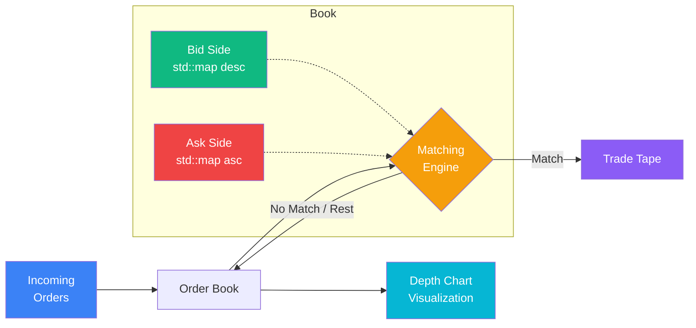

# Order Book Simulator & Matching Engine

[](https://github.com/nicholim/quant-lab/actions/workflows/ci.yml)
[](LICENSE)
[](https://en.cppreference.com/w/cpp/17)
[](https://www.python.org/)
[](.clang-format)
[](https://docs.astral.sh/ruff/)
[](tests/)

A real **price-time-priority limit order book matching engine** in C++17, with a Python layer for
order-flow simulation and depth-of-book visualization.

## Why this exists

Most "order book" libraries in the quant-research ecosystem are *model-based* — they approximate
fills with stochastic intensity functions (e.g. Avellaneda-Stoikov) rather than actually matching
orders. This project does the opposite: it is a deterministic matching engine that matches every
incoming order against resting liquidity using the exact **price-time priority** semantics real
exchanges use (best price first, FIFO within a price level), including partial fills that sweep
multiple price levels. The C++ core keeps the hot path fast and allocation-light; the Python layer
handles the things Python is good at — generating order flow and plotting the book.

## Architecture

The system is split in two: a C++17 matching-engine core (the deterministic, performance-sensitive
part) and a Python visualization/simulation layer (order-flow generation and charting). The two are
bridged by **pybind11 bindings** (`orderbook` package) so Python can drive the live C++ engine
directly — submit orders, read fills, and inspect book state in-process — in addition to the legacy
JSON order-flow + charting path.



**Matching semantics (price-time priority):**

1. An incoming order is matched against the opposite side, **best price first**.
2. Within a price level, resting orders are filled **in arrival order (FIFO)**.
3. A `LIMIT` order matches only at prices no worse than its limit; any unfilled remainder **rests**
   in the book. A `MARKET` order matches until filled or the book is exhausted (no remainder rests).
4. Incoming orders can **partially fill** across multiple levels; resting orders track
   `remaining_quantity` independently.

### C++ core vs. Python layer

| Layer | Responsibility | Key files |
|-------|----------------|-----------|
| **C++17 core** | `OrderBook` (single symbol) + `MatchingEngine` (multi-symbol router); matching, partial fills, cancel/modify, depth queries | `include/`, `src/order_book.cpp`, `src/matching_engine.cpp` |
| **Demo** | Scripted scenario: place → match → cancel → sweep, prints book state | `src/main.cpp` |
| **Python bindings** | pybind11 module exposing `OrderBook`/`MatchingEngine`/`Order`/`Trade` + the `Side`/`OrderType`/`TimeInForce` enums so Python drives the live engine | `src/bindings.cpp`, `python/orderbook/` |
| **Python viz** | Depth chart, trade tape, spread-over-time (matplotlib) — rendered from real engine state | `python/visualizer.py` |
| **Python sim** | Synthetic order flow driven through the **live C++ engine** via the binding; collects real fills, spread, and depth | `python/simulator.py` |

## Features

- **Price-time priority** — best-price-first, FIFO-within-level matching, as used by major exchanges
- **Order types** — `MARKET` and `LIMIT` orders, with partial-fill support across price levels
- **Time-in-force** — `GTC` (default), `IOC` (Immediate-Or-Cancel), `FOK` (Fill-Or-Kill), and
  `POST_ONLY` (maker-only), set via the `Order::tif` field
- **Order management** — add, cancel, and modify resting orders
- **Book depth** — bid/ask depth at configurable levels, best bid/ask, spread, volume-at-price
- **Multi-symbol** — `MatchingEngine` routes to a separate `OrderBook` per symbol
- **Python bindings (pybind11)** — drive the live C++ engine from Python: submit MARKET/LIMIT ×
  GTC/IOC/FOK/POST_ONLY orders and read back fills + book state in-process (no subprocess)
- **Python visualization** — depth charts, trade tape, and spread analysis

> **Scope note:** price types are `MARKET` and `LIMIT` only. Stop / stop-limit / iceberg orders are
> intentionally **not** implemented — see [Roadmap](#roadmap). IOC / FOK / post-only are modeled as a
> `TimeInForce` flag on top of the price type (the FIX-style split), not as extra `OrderType` values.

### Time-in-force semantics

| TIF | Behavior |
|-----|----------|
| `GTC` (default) | Match against the book, then rest any remainder (`LIMIT` only; `MARKET` never rests). |
| `IOC` | Match as much as possible immediately; cancel any unfilled remainder (never rests). |
| `FOK` | Fill the **entire** quantity immediately or do nothing — no partial fills, book left untouched on kill. |
| `POST_ONLY` | Maker-only: rejected (nothing rests, no trades) if it would cross/take liquidity; otherwise rests. |

## Technical highlights

- **Correct price-time priority** — `std::map` gives sorted price levels, `std::list` gives FIFO
  within each level, matching how exchange order books actually work.
- **Partial fill handling** — incoming orders match across multiple price levels; resting orders
  track `remaining_quantity` independently.
- **O(1) order lookup for cancel** — a `std::unordered_map` indexes order ID → (side, price) so
  cancellation does not scan the book.
- **RAII / no raw pointers** — no manual `new`/`delete`; allocations stay inside STL containers.
- **Const-correct API** — read-only methods (`get_best_bid`, `get_depth`, …) are `const`.

## Tech stack

- **C++17** — core matching engine (STL: `std::map`, `std::list`, `std::chrono`)
- **CMake** (≥ 3.16) — build system; GoogleTest pulled via `FetchContent`
- **Python 3.10+** — visualization and market simulation
- **matplotlib / NumPy** — charts and order-flow generation

## Quick Start

### Prerequisites

- A C++17 compiler (clang or gcc) and **CMake ≥ 3.16**
- **Python 3.10+** (for the viz/simulator layer and the pytest suite)

### 1. Build & run the C++ engine

```bash
git clone https://github.com/nicholim/quant-lab.git
cd order-book-simulator

# Configure + build (GoogleTest is fetched automatically on first configure)
cmake -S . -B build -DCMAKE_BUILD_TYPE=Release
cmake --build build

# Run the demo scenario (src/main.cpp)
./build/order_book_demo
```

Expected output (abridged — the demo places orders, matches a market buy, sweeps the book on a
crossing limit, cancels, then sweeps all bids):

```
=== Order Book Simulator & Matching Engine ===

[1] Placing limit BUY orders...
[2] Placing limit SELL orders...

--- AAPL Order Book ---
  ASK  $151.50  qty=50  (1 orders)
  ASK  $151.00  qty=200  (1 orders)
  ASK  $150.50  qty=100  (1 orders)
  ---- spread: $0.50 ----
  BID  $150.00  qty=150  (1 orders)
  BID  $149.50  qty=200  (1 orders)
  BID  $149.00  qty=100  (1 orders)
  Bids: 3 orders, Asks: 3 orders

[3] Market BUY 80 shares...
  TRADE: AAPL 80 @ $150.50 (buyer=7, seller=4)     <- fills best ask, partial leaves qty=20
...
[4] Limit SELL 200 @ $149.50 (crosses spread)...
  TRADE: AAPL 150 @ $150.00 (buyer=3, seller=8)    <- sweeps best bid
  TRADE: AAPL 50 @ $149.50 (buyer=2, seller=8)     <- partial at next level
...
=== Done ===
```

The `cmake --build build` above also compiles the **pybind11 extension** into
`python/orderbook/_orderbook.*.so` (via FetchContent — no pip/system install of pybind11 needed),
so `import orderbook` works immediately:

```python
from orderbook import MatchingEngine, Order, Side, OrderType, TimeInForce

engine = MatchingEngine()
engine.submit_order(Order(1, "AAPL", Side.SELL, OrderType.LIMIT, 150.0, 100))
trades = engine.submit_order(Order(2, "AAPL", Side.BUY, OrderType.LIMIT, 150.0, 60))
print(trades[0].price, trades[0].quantity)   # 150.0 60

book = engine.get_order_book("AAPL")
print(book.get_best_ask(), book.get_volume_at_price(150.0))   # 150.0 40

# IOC / FOK / POST_ONLY via the tif argument
engine.submit_order(Order(3, "AAPL", Side.BUY, OrderType.LIMIT, 150.0, 25, TimeInForce.IOC))
```

(Run from `python/`, or put `python/` on `PYTHONPATH`.) To build only the C++ demo + tests without
the binding, pass `-DBUILD_PYTHON_BINDINGS=OFF`.

### 2. Run the Python simulator & visualizer

```bash
pip install -r python/requirements.txt

# Generate synthetic order flow, drive it through the LIVE C++ engine via the
# binding, and print the real engine output (trades, best bid/ask, depth).
python python/simulator.py --orders 500 --seed 42

# Same run, but also render depth chart / trade tape / spread charts (headless)
# from the actual matching-engine state into out/.
python python/simulator.py --orders 500 --seed 42 --plot out/
```

`simulator.py` no longer matches orders in Python — it submits the generated
flow to `orderbook.OrderBook.add_order` and reads fills/depth/spread straight
off the C++ engine, then hands that real state to `visualizer.py`. (Requires the
compiled extension; build it in step 1 first.)

### 3. Run the tests

```bash
# C++ unit tests (53 GoogleTest cases via ctest)
cmake -S . -B build && cmake --build build
ctest --test-dir build --output-on-failure

# Python tests (27 tests; drives the compiled pybind11 engine in-process +
# covers the viz/sim modules). Build the extension first (step 1 above).
pytest          # from the repo root; runs with coverage (--cov-fail-under=80)
```

### 4. Benchmark the matching engine

There are **two** benchmarks for the same synthetic workload (~80% LIMIT / 20% MARKET, both sides,
around a drifting mid, identical tick/quantity ladders): a **native C++** one that isolates the pure
matching path, and a **Python** one that drives the engine through the pybind11 binding. Comparing
them shows the per-call binding overhead.

#### Native C++ (pure matching path — no Python, no binding)

`benchmarks/bench.cpp` (CMake target `order_book_bench`) pre-generates the order flow in C++, then
times `OrderBook::add_order` in a tight loop with `std::chrono::steady_clock`. Flow generation is
excluded from the timed region. Built `-O2` (Release). It is a benchmark, **not** a ctest test.

```bash
cmake -S . -B build -DCMAKE_BUILD_TYPE=Release && cmake --build build
./build/order_book_bench                  # 500k orders/run, seed 7, ~1s total
./build/order_book_bench 2000000 5 7      # <orders> <repeat> <seed>
```

Measured on an **Apple M2 Pro (arm64, macOS 26.5)**, **Release/-O2**, 500,000 orders/run, seed 7:

| Metric | Value |
|--------|-------|
| Throughput | **~7,790,000 orders/sec** (best of 3 runs) |
| Latency p50 | **84 ns** |
| Latency p90 | **250 ns** |
| Latency p99 | **500 ns** |
| Trades produced | 466,116 on 500,000 orders |

#### Python (via the pybind11 binding)

`benchmarks/bench.py` drives the live C++ engine through the `orderbook` binding with the same
workload and reports throughput + the per-order latency distribution (p50/p90/p99, µs). Build the
extension first (step 1), then:

```bash
python benchmarks/bench.py                       # 500k orders/run, ~10s total
python benchmarks/bench.py --orders 2000000 --repeat 5
```

Measured on the **same Apple M2 Pro (arm64, macOS 26.5), Python 3.12**, 500,000 orders/run, seed 7
(these numbers **include** the Python→C++ call overhead — the matching path itself is the native
number above):

| Metric | Value |
|--------|-------|
| Throughput | **~186,000 orders/sec** (best of 3 runs) |
| Latency p50 | **4.8 µs** |
| Latency p90 | **10.6 µs** |
| Latency p99 | **18.1 µs** |
| Trades produced | 466,518 on 500,000 orders |

The native engine is **~42× faster** than the binding-driven path (≈7.79M vs ≈186k orders/sec; p50
84 ns vs 4.8 µs) — i.e. for this workload the pybind11 call/marshalling cost dominates, and the pure
matching loop is far cheaper than the Python-binding numbers suggest. (Trade counts differ by ~400
because the two harnesses use different RNGs — `std::mt19937` vs CPython's Mersenne — for the same
distribution; the workload shape is identical.)

## Usage (C++)

```cpp
#include "matching_engine.h"

MatchingEngine engine;

// Place limit orders: {id, symbol, side, type, price, quantity, remaining_quantity}
engine.submit_order({1, "AAPL", Side::BUY,  OrderType::LIMIT, 150.00, 100, 100});
engine.submit_order({2, "AAPL", Side::SELL, OrderType::LIMIT, 150.50, 50,  50});

// A market order triggers a match against the best ask
auto trades = engine.submit_order(
    {3, "AAPL", Side::BUY, OrderType::MARKET, 0, 30, 30});
// trades[0]: 30 @ $150.50

// Query book state
const auto& book = engine.get_order_book("AAPL");
auto best_bid = book.get_best_bid();   // std::optional<double>
auto depth    = book.get_ask_depth(5); // std::vector<DepthLevel>
```

## vs. ABIDES / mbt-gym

All three relate to limit-order-book research, but they sit at very different layers. The key
distinction: **this project is a real price-time-priority matching engine**; mbt-gym is
**model-based** (it does not match orders); ABIDES is a full agent-based simulator that *does*
include LOB matching plus latency modeling.

| | **This project** | [**ABIDES**](https://github.com/abides-sim/abides) | [**mbt-gym**](https://github.com/JJJerome/mbt_gym) |
|---|---|---|---|
| Core idea | Deterministic price-time-priority matching engine | Discrete-event, multi-agent market simulator | Model-based LOB trading as an RL gym |
| Real order matching | **Yes** — best-price-first, FIFO-in-level, partial fills | **Yes** — order-matching engine resolves crossing orders | **No** — fills come from stochastic intensity models (Avellaneda-Stoikov style) |
| Latency modeling | No | **Yes** — discrete-event simulation models agent/network latency | Stochastic latency in the control model, not a network sim |
| Background/trading agents | No (you drive order flow) | **Yes** — populations of interacting background agents | Agents are RL policies / an adversary, not a LOB crowd |
| RL / gym interface | No | Yes (ABIDES-gym) | **Yes** — that's the point |
| Language | C++17 core + Python viz | Python | Python (NumPy/Numba, vectorized) |
| Best for | Learning/teaching matching mechanics; a fast, exact LOB primitive | Realistic market-microstructure & latency experiments | Training RL market-making agents on a stochastic model |

**What this project does well:** an honest, readable, deterministic matching engine — exactly the
mechanics (price-time priority, partial fills, cancel/modify, multi-symbol routing) that the
model-based tools abstract away.

**What it intentionally doesn't do:** no latency/network simulation, no agent populations, no RL
environment, no stochastic order-arrival model, and no exotic order types (see below).

**Who it's for:** anyone who wants to *see* how a matching engine actually works, or needs a small,
fast, exact LOB primitive to build on — rather than a research-grade agent-based or RL framework.
For ecosystem context, see [awesome-quant](https://github.com/wilsonfreitas/awesome-quant).

## Project structure

```
order-book-simulator/
├── CMakeLists.txt            # CMake build (C++17) + GoogleTest & pybind11 via FetchContent
├── benchmarks/
│   ├── bench.cpp             # Native C++ throughput + latency harness (target order_book_bench, no binding)
│   └── bench.py              # Throughput + latency harness (drives the engine via the binding)
├── include/
│   ├── order.h               # Order struct, Side / OrderType / TimeInForce enums
│   ├── trade.h               # Trade struct
│   ├── order_book.h          # Single-symbol order book
│   └── matching_engine.h     # Multi-symbol engine facade
├── src/
│   ├── order_book.cpp        # Price-time priority matching implementation
│   ├── matching_engine.cpp   # Symbol routing and book management
│   ├── bindings.cpp          # pybind11 module (_orderbook): engine exposed to Python
│   └── main.cpp              # Demo: place, match, cancel, sweep
├── tests/
│   ├── test_order_book.cpp   # 53 GoogleTest cases (ctest)
│   ├── conftest.py           # Puts python/ on sys.path for the test suite
│   ├── test_orderbook.py     # Binding-driven engine tests (in-process, no subprocess)
│   ├── test_simulator_engine.py # Simulator→C++ engine→visualizer end-to-end (headless Agg)
│   └── test_python_viz.py    # Visualizer/flow-generator tests (headless Agg)
└── python/
    ├── requirements.txt
    ├── orderbook/            # pybind11 re-export package (compiled _orderbook lands here)
    ├── visualizer.py         # Depth chart, trade tape, spread plots (from real engine state)
    └── simulator.py          # Order-flow generator + EngineSimulator (drives the C++ engine)
```

## Data structures

| Component | Structure | Complexity |
|-----------|-----------|------------|
| Bid levels | `std::map<double, list<Order>, greater>` | O(log N) insert/lookup |
| Ask levels | `std::map<double, list<Order>>` | O(log N) insert/lookup |
| Orders at a level | `std::list<Order>` | O(1) FIFO pop, O(N) cancel within level |
| Order index | `std::unordered_map<id, (side, price)>` | O(1) lookup for cancel |

## Roadmap

Intentionally out of scope today, in rough priority order:

- Stop / stop-limit orders (trigger on last trade price) and iceberg orders
- WASM compile of the C++ core for an in-browser depth-chart demo on the showcase site

The Python simulation layer now drives the live C++ engine end-to-end:
`simulator.EngineSimulator` submits generated flow to `orderbook.OrderBook` and
feeds the real fills/depth/spread into `visualizer.OrderBookVisualizer.plot_simulation`
(done 2026-06-02).

## Contributing

See [CONTRIBUTING.md](CONTRIBUTING.md) for the C++ (clang-format + GoogleTest/ctest) and Python
(ruff + mypy + pytest) workflows, branch naming, and commit conventions.

## License

[MIT](LICENSE)
