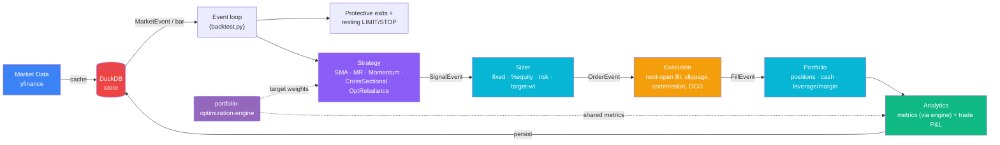
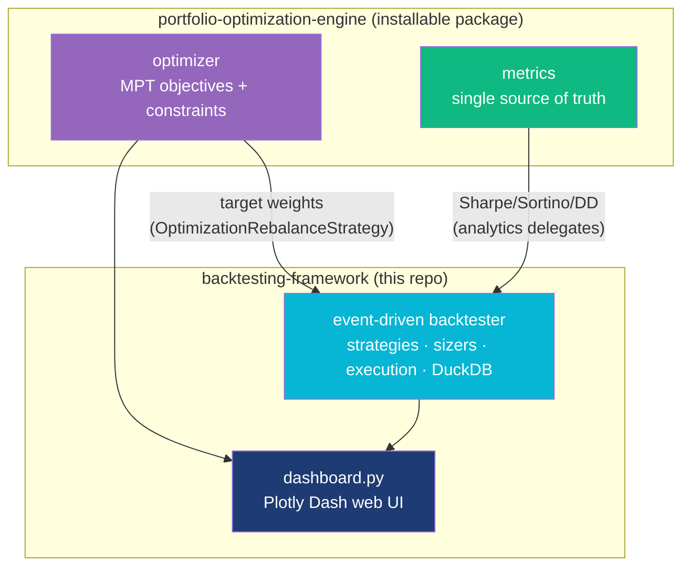

# Quantitative Backtesting Framework

[](https://github.com/nicholim/quant-lab/actions/workflows/ci.yml)
[](LICENSE)
[](https://www.python.org/)
[](https://github.com/astral-sh/ruff)

**A multi-asset, event-driven backtester that fills at the next bar's open, persists every run to DuckDB for SQL comparison, and runs walk-forward MPT-optimized portfolios out-of-sample.**

## Why this exists

Most lightweight Python backtesters trade away realism for speed: they fill on the
signal bar (look-ahead), test one instrument at a time, or vectorize the simulation so
path-dependent logic (trailing stops, OCO brackets, margin) can't be expressed. This
framework keeps a true per-event loop — Market → Signal → Order → Fill — so fills land at
the **next bar's open**, position-by-position protective exits work, and the same engine
that backtests a strategy also runs a **walk-forward MPT rebalancer** by calling the
sibling [portfolio-optimization-engine](../portfolio-optimization-engine). Every run is
written to an embedded DuckDB database, so comparing strategies, slicing trades, or
auditing slippage is just SQL. It is meant as a readable, hackable research engine — not a
broker-connected live-trading platform.

## Architecture



### The event loop (one bar at a time)

`Backtest.run()` (`src/backtest.py`) drives a single chronological pass. For each bar the
`DataHandler` emits one `MarketEvent` per symbol, and the loop:

1. **Mark to market** once per timestamp — record the equity snapshot (guarded so multiple
   per-symbol events on the same bar don't inject phantom zero-returns).
2. **Fill resting orders** — any pending LIMIT/STOP is checked against this bar's high/low;
   filling one leg of an OCO/bracket cancels its siblings.
3. **Protective exits** — per-position stop-loss / take-profit / trailing stops are
   evaluated on the close, before strategy signals.
4. **Strategy** turns the bar into an optional `SignalEvent` (direction or target weight).
5. **Portfolio** sizes the signal into an `OrderEvent` via the active `Sizer` (and rejects
   sells when flat — long-only by default).
6. **Execution** fills the order at the **next bar's open**, applying slippage + commission,
   and returns a `FillEvent`.
7. **Portfolio** applies the fill (cash, positions, leverage/margin interest).

After the loop, `PerformanceAnalytics` computes metrics (delegating Sharpe/Sortino/drawdown
to the engine's shared `metrics` module) and the run is persisted to DuckDB.

| Component | File | Responsibility |
|-----------|------|----------------|
| Data handler | `src/data_handler.py` | `DataHandler` ABC + `YFinanceDataHandler` (DuckDB-cached OHLCV, no look-ahead reads) |
| Events | `src/events.py` | Typed dataclasses: `MarketEvent`, `SignalEvent`, `OrderEvent`, `FillEvent` |
| Strategy | `src/strategy.py` | `Strategy` ABC + SMA, mean-reversion, momentum, cross-sectional, MPT rebalance |
| Sizing | `src/sizing.py` | `Sizer` ABC: fixed-fractional, %-equity, risk-based, target-weight |
| Portfolio | `src/portfolio.py` | Cash/positions, protective exits, margin/leverage |
| Execution | `src/execution.py` | Next-open fills, slippage, commission, OCO/bracket cancellation |
| Analytics | `src/analytics.py` | Reports/plots; risk metrics delegated to the engine |
| Datastore | `src/datastore.py` | DuckDB cache + run persistence + SQL query interface |
| Orchestrator | `src/backtest.py` | The event loop above |

## Features

- **Event-Driven Architecture** — Decoupled components communicating via typed events (Market, Signal, Order, Fill)
- **DuckDB Data Store** — Local caching of market data (instant re-runs) + persistent backtest results with SQL query interface
- **Strategy Library** — Built-in SMA crossover, z-score mean reversion, momentum, and an **MPT walk-forward rebalancer** powered by the [portfolio-optimization-engine](../portfolio-optimization-engine)
- **MPT Integration** — `OptimizationRebalanceStrategy` re-optimizes target weights (max-Sharpe / min-vol / min-CVaR / risk-parity) on a rolling window and executes them net of costs — an out-of-sample test of optimized portfolios
- **Realistic fills** — Orders fill at the **next bar's open**, not the signal bar's close (avoids the same-bar fill that overstates results)
- **Shared metrics** — Sharpe/Sortino/drawdown come from the engine's `metrics` module, so this backtester and the optimizer report identical numbers for the same return series
- **Transaction Costs** — Configurable slippage model and percentage-based commissions
- **Position Sizing** — Pluggable sizers: fixed-fractional, percent-of-equity, risk-based (vol-targeted), target-weight
- **Order Types** — MARKET (next-open fill) plus resting LIMIT and STOP orders, with OCO/bracket groups (one fill cancels the siblings)
- **Protective Exits** — Per-position stop-loss, take-profit, and trailing stops, checked every bar
- **Parameter Optimization** — Grid-search any strategy with a Sharpe/return heatmap, persisted to DuckDB
- **Performance Analytics** — Sharpe, Sortino, Calmar ratios, max drawdown, duration, profit factor, **beta/alpha vs a benchmark**
- **Cross-Strategy Comparison** — SQL queries across all historical backtest runs
- **Parquet Export** — Export any table to Parquet for external analysis
- **Visualization** — Static matplotlib (equity curve, drawdown, monthly heatmap) plus **interactive Bokeh** charts (pan/zoom/hover) exported to standalone HTML
- **Multi-timeframe** — Strategies can read resampled higher-timeframe (weekly/monthly) bars without look-ahead
- **Margin / leverage** — Optional leverage cap with buying-power-constrained sizing and daily margin interest on borrowed cash

## Technical Highlights

- **Clean event-driven design** — Typed dataclass events (Market → Signal → Order → Fill) with ABC-based strategy/execution interfaces for easy extension
- **Round-trip P&L matching** — Win rate and profit factor computed from actual FIFO-matched buy/sell pairs, not raw trade counts
- **Long-only enforcement** — Portfolio rejects sell signals when flat, preventing accidental naked short positions
- **DuckDB-backed caching** — First run downloads from yfinance, subsequent runs served instantly from local DuckDB store; no wasted API calls
- **Resilient data fetch** — Beneath the DuckDB cache, `src/market_data.py` wraps yfinance with retry + exponential backoff on transient/rate-limit errors and a clear `MarketDataError`. An OFFLINE escape hatch (`offline=True` arg or `BACKTESTING_OFFLINE=1`) serves a bundled deterministic OHLCV fixture (`src/data/sample_ohlcv.csv`) so demos never hard-fail on cloud egress
- **SQL query interface** — Cross-strategy comparison, slippage analysis, and custom queries against all historical backtest runs via `store.query(sql)`
- **Parquet export** — One-line export of any table for use in external analytics tools (pandas, Spark, R)

## Tech Stack

- **Python 3.10+**
- **DuckDB** — Embedded analytical database for data caching and result persistence
- **pandas / NumPy** — Data handling and numerical computation
- **matplotlib / seaborn** — Charting, heatmaps
- **yfinance** — Historical market data
- **tabulate** — Formatted report output

## Quick Start

```bash
git clone https://github.com/nicholim/quant-lab.git
cd backtesting-framework

python -m venv venv
source venv/bin/activate
pip install -r requirements.txt   # also installs the sibling optimization engine (editable)

python main.py        # run the example strategies (CLI)
python dashboard.py   # OR launch the web UI at http://127.0.0.1:8050
```

## Web dashboard (GUI)

`dashboard.py` is a unified [Plotly Dash](https://dash.plotly.com/) app spanning
both repos: choose tickers / dates / objective in the sidebar, click **Run**, and
it (1) optimizes the portfolio with the engine — efficient frontier, weights,
Monte Carlo VaR/CVaR — then (2) runs a walk-forward rebalancing **backtest** of
that objective and shows the equity curve, drawdown, and beta/alpha. Everything
else (`main.py`, the Python API) remains available; the dashboard is just an
interactive front end over `run_analysis`, `Backtest`, and the Plotly figures.

> This framework depends on the [portfolio-optimization-engine](../portfolio-optimization-engine)
> as a one-way dependency (backtester → engine). `requirements.txt` installs it in
> editable mode from `../portfolio-optimization-engine`; clone both repos side by side.

## Example Output

```
============================================================
Strategy: SMA Crossover (20/50)
============================================================
Fetching data...
Running backtest...
Backtest complete.
Results saved to DuckDB (run_id=1)

==================================================
PERFORMANCE REPORT
==================================================
Metric                 Value
---------------------  ---------
Total Return           9.00%
Annualized Return      0.72%
Annualized Volatility  4.45%
Sharpe Ratio           -0.29
Sortino Ratio          -0.20
Max Drawdown           -12.96%
Max DD Duration        1515 days
Calmar Ratio           0.06
Total Trades           62
==================================================

============================================================
Strategy: Mean Reversion (z=2.0) — using DuckDB cache
============================================================
Fetching data...          ← instant, served from DuckDB cache
Running backtest...
Backtest complete.
Results saved to DuckDB (run_id=2)

==================================================
STRATEGY COMPARISON (from DuckDB)
==================================================
 run_id          strategy_name       tickers  return_%  sharpe  max_dd_%  total_trades
      1  SMA Crossover (20/50) AAPL,MSFT,JPM      9.00   -0.29    -12.96            62
      2 Mean Reversion (z=2.0) AAPL,MSFT,JPM     -3.52   -0.41    -12.69           187

==================================================
TOP 5 TRADES BY SLIPPAGE (SQL query)
==================================================
symbol direction  quantity  price  slippage          strategy_name
   JPM      SELL       269 102.16     13.75 Mean Reversion (z=2.0)
   JPM      SELL       203 130.16     13.22 Mean Reversion (z=2.0)
   JPM       BUY       222 107.26     11.90 Mean Reversion (z=2.0)
  MSFT      SELL        80 282.30     11.30 Mean Reversion (z=2.0)
   JPM      SELL       162 136.47     11.06  SMA Crossover (20/50)
```

## vs. backtrader / vectorbt / backtesting.py / zipline-reloaded

An honest positioning against the popular OSS backtesters. Capabilities below reflect each
tool's **open-source** edition as of mid-2026.

| Capability | **This framework** | backtrader | vectorbt (OSS) | backtesting.py | zipline-reloaded |
|---|---|---|---|---|---|
| Engine model | Event-driven (per-bar loop) | Event-driven | **Vectorized** (array ops) | Event-driven | Event-driven |
| Multi-asset / portfolio | Yes | Yes | Yes | **No** (single instrument) | Yes |
| Fills at next bar's open | Yes (built-in) | Configurable (cheat-on-open off) | N/A (vectorized) | Next-bar open | Next-bar |
| Resting LIMIT/STOP + OCO brackets | Yes | Yes | PRO-only expanded orders | Limited | Yes |
| Per-position trailing/protective exits | Yes | Yes | Path-dependent stops are PRO | Basic SL/TP | Yes |
| Slippage + commission models | Yes (first-class) | Yes | Basic (fees/slippage scalars) | Basic | Yes (slippage + cost models) |
| Walk-forward MPT optimization | **Yes** (calls optimizer engine) | DIY | DIY | DIY | DIY (Pyfolio/empyrical) |
| Result persistence + SQL query | **Yes (DuckDB)** | No | No | No | Ingest bundles (no run DB) |
| Parameter sweep / heatmap | Yes (grid + walk-forward) | Yes (optstrategy) | **Yes (fastest at scale)** | Yes | Limited |
| Built-in web dashboard | **Yes (Dash)** | No | No | Bokeh plot output | No |
| Live / broker trading | **No** | Yes (IB, Oanda, etc.) | No (PRO targets it) | No | No (needs external bridge) |
| Maintenance | Active (this project) | Community | **No longer maintained** (last free 0.28.1) | Active | Active |

**What this project does well:** realistic path-dependent simulation (next-open fills,
trailing stops, OCO, margin), zero-config result persistence + SQL across runs, and a
turnkey "optimize → backtest out-of-sample" workflow wired to the optimizer engine, plus a
Dash GUI.

**What it intentionally does *not* do:** no live/paper broker integration (use backtrader or
a zipline bridge for that), no intraday tick/L2 data, and no vectorized parameter sweeps at
vectorbt's scale — the per-bar loop trades raw throughput for realism and introspection.

**Who it's for:** researchers who want a readable event-driven engine they can extend, who
value auditable runs (every trade in DuckDB) and want to stress-test MPT-optimized
portfolios net of costs — rather than a production trading stack.

> Ecosystem context: see [awesome-quant](https://github.com/wilsonfreitas/awesome-quant)
> for the broader landscape of Python quant libraries.

## Benchmarks

`benchmarks/throughput.py` measures end-to-end event-loop throughput on a deterministic
synthetic random walk (no network, no DuckDB I/O) so the numbers are reproducible. One
"event" is one `(bar, symbol)` pair — the unit the loop actually iterates over.

```bash
python benchmarks/throughput.py                          # 2520 bars x 5 symbols (~10y daily)
python benchmarks/throughput.py --bars 5040 --symbols 10 --repeat 5
```

Measured on an Apple Silicon (arm64) laptop, CPython 3.12, SMA-crossover strategy:

| Workload | Events | Best throughput | Wall time |
|---|---|---|---|
| 2,520 bars × 5 symbols (~10y daily, 5 assets) | 12,600 | ~4,980 events/sec | ~2.5 s |
| 5,040 bars × 1 symbol (~20y daily) | 5,040 | ~4,490 events/sec | ~1.1 s |

This is a Python per-bar loop, so throughput is intentionally in the thousands-of-events/sec
range — fine for daily multi-asset research, not for vectorized million-path sweeps (use
vectorbt for that). Re-run the script on your hardware for local numbers.

## Usage

### Basic Backtest

```python
from src.datastore import DataStore
from src.data_handler import YFinanceDataHandler
from src.strategy import MovingAverageCrossover
from src.portfolio import Portfolio
from src.execution import SimulatedExecution
from src.backtest import Backtest

store = DataStore("data/backtests.duckdb")

data = YFinanceDataHandler(["AAPL", "MSFT", "JPM"], "2020-01-01", "2024-01-01", store=store)
strategy = MovingAverageCrossover(short_window=20, long_window=50)
portfolio = Portfolio(initial_capital=100_000, position_size_pct=0.15)
execution = SimulatedExecution(commission_pct=0.001, slippage_pct=0.0005)

bt = Backtest(data, strategy, portfolio, execution, strategy_name="SMA 20/50", store=store)
analytics = bt.run()
analytics.generate_report()
analytics.plot_equity_curve()
```

### SQL Queries on Backtest History

```python
store = DataStore("data/backtests.duckdb")

# Compare all strategies
store.compare_strategies()

# Custom SQL — trades where drawdown exceeded threshold
store.query("""
    SELECT r.strategy_name, t.symbol, t.direction, t.quantity, t.price
    FROM trades t
    JOIN backtest_runs r ON t.run_id = r.run_id
    WHERE t.slippage > 10
    ORDER BY t.slippage DESC
""")

# Export to Parquet
store.export_parquet("trades", "exports/all_trades.parquet")
```

### MPT Walk-Forward Rebalancing (engine integration)

```python
from src.strategy import OptimizationRebalanceStrategy

tickers = ["AAPL", "MSFT", "JPM"]
strategy = OptimizationRebalanceStrategy(
    tickers,
    lookback=252,        # trailing window for optimization
    rebalance_freq=21,   # ~monthly
    objective="sharpe",  # "sharpe" | "min_vol" | "min_cvar" | "risk_parity"
)
# ...wire into Backtest exactly like any other strategy.
```

Each rebalance calls the optimization engine on the trailing window (long-only, no
look-ahead) and emits target-weight orders that execute net of slippage + commission —
the canonical "does MPT survive costs and drift?" experiment.

### Position Sizing & Protective Exits

```python
from src.portfolio import Portfolio
from src.sizing import RiskBasedSizer

portfolio = Portfolio(
    initial_capital=100_000,
    sizer=RiskBasedSizer(risk_per_trade=0.02, lookback=20),  # volatility-targeted
    stop_loss_pct=0.10,        # exit a long if it falls 10% from entry
    take_profit_pct=0.25,      # take profit at +25%
    trailing_stop_pct=0.15,    # or trail 15% below the peak since entry
)
```

Sizers: `FixedFractionalSizer`, `PercentOfEquitySizer`, `RiskBasedSizer`,
`TargetWeightSizer`. Protective exits are evaluated each bar on the close and
fill at the next open like any order.

### Parameter Optimization + Heatmap

```python
from src.param_search import grid_search, heatmap
from src.strategy import MovingAverageCrossover
from src.data_handler import YFinanceDataHandler

store = DataStore("data/backtests.duckdb")
results = grid_search(
    MovingAverageCrossover,
    {"short_window": [10, 20, 30], "long_window": [50, 100, 150]},
    data_factory=lambda: YFinanceDataHandler(["AAPL", "MSFT", "JPM"],
                                             "2020-01-01", "2024-01-01", store=store),
    store=store,            # each combo is persisted as a run; cache means one download
    benchmark="SPY",
)
print(results.sort_values("sharpe", ascending=False))
heatmap(results, x_param="short_window", y_param="long_window", metric="sharpe")
```

Every combination is a normal backtest row in DuckDB, so you can also slice the
grid with SQL via `store.query(...)`.

**Walk-forward (out-of-sample) optimization** — the overfit-resistant version:
optimize on a rolling in-sample window, then report performance only on the
*following* out-of-sample window.

```python
from src.param_search import walk_forward
from src.strategy import MovingAverageCrossover
from src.data_handler import YFinanceDataHandler

wf = walk_forward(
    MovingAverageCrossover,
    {"short_window": [10, 20], "long_window": [50, 100]},
    data_factory=lambda s, e: YFinanceDataHandler(["AAPL", "MSFT", "JPM"], s, e, store=store),
    start="2018-01-01", end="2024-01-01",
    is_months=24, oos_months=12, metric="sharpe",
)
print(wf)  # one row per OOS window: chosen params + out-of-sample sharpe/return/drawdown
```

### Custom Strategy

```python
from src.strategy import Strategy
from src.events import MarketEvent, SignalEvent, Direction
from src.data_handler import DataHandler

class MyStrategy(Strategy):
    def calculate_signals(self, event: MarketEvent, data: DataHandler) -> SignalEvent | None:
        bars = data.get_latest_bars(event.symbol, 10)
        if len(bars) < 10:
            return None
        # Your logic here
        return SignalEvent(timestamp=event.timestamp, symbol=event.symbol, direction=Direction.BUY)
```

## Project Structure

```
backtesting-framework/
├── main.py                # CLI entry point — runs strategies, compares via DuckDB
├── dashboard.py           # Unified Plotly Dash web UI (optimize + backtest)
├── requirements.txt
├── benchmarks/
│   └── throughput.py      # Event-loop throughput on synthetic data (no network)
├── data/                  # DuckDB database (gitignored)
│   └── backtests.duckdb
└── src/
    ├── datastore.py        # DuckDB store: OHLCV cache, result persistence, SQL queries
    ├── events.py           # Typed event classes (Market, Signal, Order, Fill)
    ├── data_handler.py     # DataHandler ABC + YFinanceDataHandler (DuckDB-backed)
    ├── strategy.py         # Strategy ABC + SMA, Mean Reversion, Momentum, CrossSectional, OptimizationRebalance
    ├── sizing.py           # Sizer ABC + FixedFractional/PercentOfEquity/RiskBased/TargetWeight
    ├── portfolio.py        # Position/cash tracking; delegates sizing to a Sizer
    ├── execution.py        # Simulated execution (next-open fills, slippage & commission)
    ├── analytics.py        # Reports/plots; risk metrics (incl. beta/alpha) delegated to the engine
    ├── param_search.py     # Grid-search + walk-forward optimization, heatmap
    ├── interactive.py      # Interactive Bokeh equity/drawdown charts (HTML)
    └── backtest.py         # Main event loop orchestrator with DuckDB persistence
```

### Interactive charts

```python
from src.interactive import plot_performance_bokeh

plot_performance_bokeh(analytics, save_path="performance.html")  # equity + linked drawdown
```

## Relationship to portfolio-optimization-engine

Two repositories, one-way dependency (no cycle): the backtester imports the
engine; the engine never imports the backtester. The unified Dash dashboard
(in this repo) sits on top and drives both.



The engine answers *"what allocation should I hold?"* (point-in-time, convex
optimization); this backtester answers *"how does that allocation perform over
time, net of costs?"* (time-sequential simulation). The engine is reusable on its
own; the dashboard wires the two together end to end. See `DEPLOY.md` for hosting.

## DuckDB Schema

| Table | Purpose |
|-------|---------|
| `ohlcv` | Cached market data (symbol, date, OHLCV) — avoids re-downloading |
| `backtest_runs` | One row per backtest: strategy, parameters, summary metrics |
| `trades` | All executed trades linked to a run_id |
| `equity_curve` | Time-series equity snapshots linked to a run_id |

## Contributing

See [CONTRIBUTING.md](CONTRIBUTING.md) for dev setup, the lint/type/test workflow, and the
branch + conventional-commit conventions.

## License

MIT — see [LICENSE](LICENSE).
