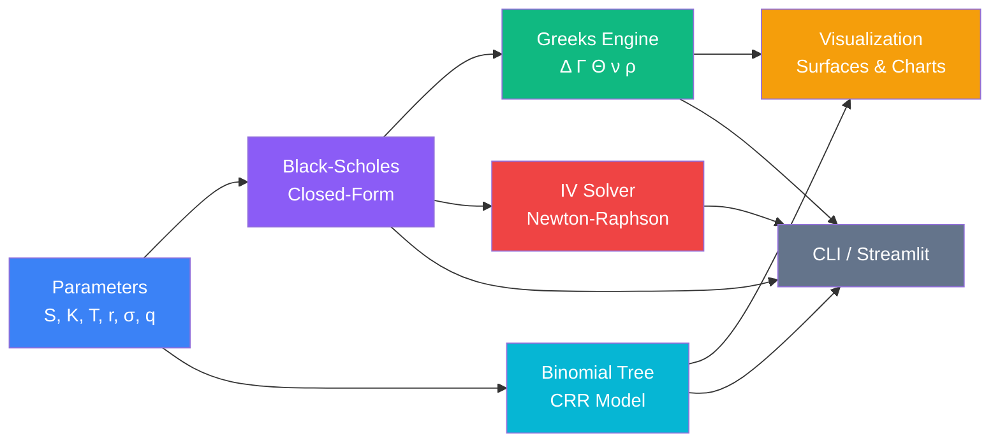

# Options Pricing Calculator

[](https://github.com/nicholim/quant-lab/actions/workflows/ci.yml)
[](LICENSE)
[](https://www.python.org/downloads/)
[](https://github.com/astral-sh/ruff)
[](tests/)
[](pyproject.toml)

A compact, readable options-pricing library: **Black-Scholes-Merton** closed-form pricing, a
**Cox-Ross-Rubinstein binomial tree** (European *and* American), the **five Greeks**, and a
**Newton-Raphson implied-volatility solver** — plus a CLI demo and an interactive Streamlit app.

## Why this exists

Most "learn options pricing" code is either a one-file gist with no tests, or a heavyweight
institutional library (QuantLib) whose surface area hides the math. This project sits in between:
small enough to read end-to-end (a handful of focused source files), correct enough to trust (238 tests cross-checked
against textbook reference values and put-call parity, ~99% coverage), and packaged with a CLI and
a web UI so you can actually *use* it. It can also pull a **real option chain** from free data and
show you, per contract, where its own Black-Scholes price disagrees with the live market mid.

It is a focused, teaching-grade vanilla-options pricer — not an institutional derivatives stack.
See [vs. QuantLib / py_vollib / mibian](#vs-quantlib--py_vollib--mibian) for an honest scope comparison.

## Architecture



Pure-function pricing core (`src/`), consumed by two interchangeable front ends (`main.py` CLI,
`app.py` Streamlit). No global state; every function takes explicit parameters.

## Features

| Capability | Where | Notes |
|------------|-------|-------|
| **Black-Scholes-Merton price** | `black_scholes_price` | European call/put, continuous dividend yield `q` (Merton form) |
| **Black-76 futures option** | `black_76_price` (+ `black_76_delta` / `_gamma` / `_vega`) | European option on a future/forward `F` — discounts the forward, no spot carry; completes the vollib "core three" (BS / BSM / Black-76) |
| **Binomial tree (CRR)** | `BinomialTree.price` | European **and** American; vectorized backward induction |
| **Greeks** | `delta`, `gamma`, `theta`, `vega`, `rho` | All dividend-adjusted; theta per calendar day, vega/rho per 1% move |
| **Higher-order Greeks** | `vanna`, `volga` (vomma), `charm` | Closed-form second-order Greeks; `vanna = d(delta)/d(σ)`, `volga = d(vega)/d(σ)`, `charm = -d(delta)/dT` |
| **Implied volatility** | `implied_volatility` | Newton-Raphson; returns `None` on non-convergence / sub-intrinsic input |
| **Vectorized / batch API** | `black_scholes_price_vec`, `greeks_vec`, `implied_volatility_vec` | Price + all Greeks + IV across a whole chain at once via NumPy broadcasting (no per-contract Python loop); accepts arrays/`pandas.Series` for strike/σ/T. Numerically identical to the scalar functions elementwise; the batch IV solver returns `nan` per element on impossible/non-converged inputs |
| **Real IV surface** | `solve_iv_surface` / `plot_solved_iv_surface` (`src/greeks_visualizer.py`) | Solves *our* IV per (strike, time-to-expiry) across multiple expiries via the vectorized solver and plots IV as the z-axis — a genuine implied-vol surface, distinct from the constant-σ `plot_price_surface` |
| **Monte-Carlo pricer** | `monte_carlo_price` → `MCResult(price, std_error)` (`src/monte_carlo.py`) | European call/put **under GBM** (same risk-neutral dynamics as Black-Scholes) with **antithetic variates + a Black-Scholes control variate** for variance reduction; seeded NumPy `Generator` for reproducibility. Returns the price **and** its standard error; validated to converge to the closed-form `black_scholes_price` within ~3 SE. Not a stochastic-vol / exotic engine. |
| **SVI vol-surface fit** | `fit_svi_slice` / `fit_svi_surface` / `svi_total_variance` / `svi_smile` (`src/vol_surface.py`) | Gatheral **raw SVI** (5-param) fit to the solved IV surface, per expiry, via `scipy.optimize.least_squares` on total variance `w = σ²·T` vs log-moneyness `k = ln(K/F)`. A smile **fit / interpolation** of the observed surface — *not* a calendar/butterfly-arbitrage-free guarantee. |
| **Edge-case handling** | core | `T→0` returns intrinsic value; `σ→0` uses deterministic forward |
| **Tree visualization** | `BinomialTree.build_tree` | Full `(N+1, N+1)` price & value lattices |
| **Charts** | `src/greeks_visualizer.py` | Greeks vs spot/time, 3D price surface (`plot_price_surface`), payoff diagrams, **real IV smile/surface** (`plot_market_iv_smile` / `plot_market_iv_surface`) from market data |
| **Live market data** | `src/market_data.py` | Price REAL option chains from FREE data: chains/expirations via yfinance, spot via Finnhub (`FINNHUB_API_KEY`) with yfinance fallback; `price_chain` adds `model_price`, `our_iv`, `mispricing`. Bundled offline sample chain (`--offline` / `OPTIONS_PRICING_OFFLINE=1`) keeps the demo running with no network |
| **CLI demo** | `main.py` | Textbook demo (no args) **or** `python main.py --symbol AAPL [--expiry … --type call\|put --offline]` to price a live chain |
| **Web app** | `app.py` | Streamlit dashboard: Calculator tab (parameter sliders) + Live market tab (fetch + price a chain, IV smile) + IV surface tab (multi-expiry solved IV surface + per-expiry smile with the **raw-SVI fit overlaid** + vectorized batch pricing, offline-safe) |

## Tech Stack

- **Python 3.10+**
- **NumPy / SciPy** — numerical core, normal distribution (`scipy.stats.norm`)
- **Streamlit** — interactive web dashboard
- **matplotlib** — static charts and 3D surface plots
- **ruff** (lint/format) · **mypy** (gradual typing) · **pytest** + **pytest-cov** (tests)

## Quick Start

```bash
git clone https://github.com/nicholim/quant-lab.git
cd options-pricing-calculator

python -m venv venv
source venv/bin/activate
pip install -r requirements.txt
```

### Use as a library

```python
from src.black_scholes import black_scholes_price, delta, gamma, implied_volatility
from src.binomial_tree import BinomialTree

# Price a European call
black_scholes_price(S=100, K=105, T=0.25, r=0.05, sigma=0.2, option_type="call")  # 2.4779

# Greeks
delta(S=100, K=105, T=0.25, r=0.05, sigma=0.2, option_type="call")  # 0.3772
gamma(S=100, K=105, T=0.25, r=0.05, sigma=0.2)                      # 0.0380

# American put via binomial tree
BinomialTree(S=100, K=105, T=0.25, r=0.05, sigma=0.2, N=200,
             option_type="put", american=True).price()             # 6.4275

# Implied volatility from a market price
implied_volatility(market_price=3.50, S=100, K=105, T=0.25, r=0.05, option_type="call")  # 0.2531
```

```python
# Monte-Carlo price (under GBM) with variance reduction — converges to closed-form BS
from src.monte_carlo import monte_carlo_price
mc = monte_carlo_price(S=100, K=105, T=0.25, r=0.05, sigma=0.2,
                       option_type="call", n_paths=200_000, seed=42)
mc.price, mc.std_error   # ~2.49 ± ~0.009 (vs BS 2.4779)

# Fit a raw-SVI smile to a solved IV surface (the solve_iv_surface output)
from src.vol_surface import fit_svi_surface, svi_smile
fits = fit_svi_surface(surface_df, spot=100.0)        # {expiry: SVIParams(a,b,rho,m,sigma)}
svi_smile(fits["2026-09-18"], T=0.3, strikes=[90, 100, 110], forward=100.0)  # fitted IVs
```

### Run the CLI demo

```bash
python main.py
```

Expected output (abbreviated):

```
============================================================
Options Pricing Calculator
============================================================

--- European CALL (S=100.0, K=105.0, T=0.25, r=0.05, σ=0.2) ---
  Black-Scholes:  $2.4779
  Binomial (EU):  $2.4819
  Binomial (AM):  $2.4819
  Delta:  0.377178
  Gamma:  0.037988
  Theta:  -0.025643 (daily)
  Vega:   0.189941 (per 1%)
  Rho:    0.088100 (per 1%)

--- European PUT (S=100.0, K=105.0, T=0.25, r=0.05, σ=0.2) ---
  Black-Scholes:  $6.1736
  Binomial (EU):  $6.1776
  Binomial (AM):  $6.4275
  Delta:  -0.622822
  ...

Implied Vol for market price $3.5: 25.3091%
```

The American put (`$6.4275`) prices above the European put (`$6.1776`) by the early-exercise
premium (`~$0.25`) — the binomial tree captures it, the closed-form Black-Scholes cannot.

### Run the Streamlit app

```bash
streamlit run app.py
# or from the monorepo root:  make run-options   (-> http://localhost:8501)
```

Opens a dashboard at `http://localhost:8501` with three tabs:
- **Calculator** — live sliders for `S, K, T, r, σ`, side-by-side Black-Scholes vs binomial
  (European/American) prices, a Greeks table, payoff and delta charts, and an IV solver.
- **Live market** — fetch and price a real option chain for a symbol/expiry, with the IV smile.
- **IV surface** — fetch chains across **multiple expiries**, solve *our* implied vol per
  (strike, expiry) via the vectorized solver (`solve_iv_surface` / `plot_solved_iv_surface`), and
  render the real solved IV surface plus a per-expiry smile. Also exposes vectorized batch pricing
  over a whole strike grid. Degrades gracefully to the bundled offline sample chain (the
  "Offline sample" checkbox or `OPTIONS_PRICING_OFFLINE=1`) so it never hard-fails without a network.

Deployment to Render or Streamlit Community Cloud is documented in [DEPLOY.md](DEPLOY.md).

## Live market data

`src/market_data.py` turns the textbook calculator into a tool that prices **real** option chains
from **free** data, then shows where its own Black-Scholes price disagrees with the live market.

### Data-source split

Two sources are used on purpose — each for what it does best, and free:

| What | Source | Key needed? | Notes |
|------|--------|:-----------:|-------|
| Option **chains** + **expirations** | **yfinance** | No | The only keyless source of full chains. |
| Underlying **spot** quote | **Finnhub** (free tier) | Optional (`FINNHUB_API_KEY`) | Real-time quotes, reliable from cloud IPs. Falls back to yfinance automatically when the key is unset or fails — Finnhub has no chains. |
| **`our_iv`** (per-contract IV) | **This library** | — | Solved from the market `mid` via `implied_volatility`. yfinance's own IV is kept as `market_iv` for comparison but is **not** trusted. |

### Public surface

```python
from src.market_data import (
    get_spot,            # get_spot(symbol, offline=False) -> float
    list_expirations,    # list_expirations(symbol, offline=False) -> list[str]
    get_option_chain,    # -> DataFrame[strike,bid,ask,mid,last,market_iv,volume,open_interest]
    price_chain,         # adds model_price, our_iv, mispricing
    clear_cache, sample_expiry, MarketDataError,
)
```

### `FINNHUB_API_KEY` (optional)

Spot quotes use Finnhub when a key is present, else yfinance. Get a free key at
[finnhub.io](https://finnhub.io) and provide it either way:

```bash
# Option A — export in your shell
export FINNHUB_API_KEY=your_key_here

# Option B — a local .env file (gitignored; loaded automatically at import)
cp .env.example .env      # then edit FINNHUB_API_KEY=your_key_here
```

The `.env` is read once at import via `python-dotenv`; a real exported variable always
wins over `.env`. It's entirely optional — with no key, `get_spot` falls back to yfinance.
If a key is *set but rejected* (Finnhub 401/403, e.g. a malformed value), the library logs one
actionable warning (the raw token, no prefix) and falls back to yfinance — so a bad key can't
silently hide behind the fallback. For the Render deploy, the key is wired as a `sync: false`
secret (paste only the raw key, no `FINNHUB_API_KEY=` prefix); see **[DEPLOY.md](DEPLOY.md)**.

### Offline mode

yfinance egress is frequently rate-limited from cloud IPs. Any of `--offline` (CLI),
`offline=True` (arg), or `OPTIONS_PRICING_OFFLINE=1` (env) serves a bundled sample chain
(`src/data/sample_chain.csv`) so the demo never hard-crashes:

```bash
python main.py --symbol AAPL --offline   # deterministic, no network
python main.py --symbol AAPL --type call # live: chains via yfinance, spot via Finnhub/yfinance
```

Real output from the offline run (trimmed):

```
========================================================================
Live option chain — AAPL (call)
========================================================================

Spot: $195.00   Expiry: 2026-07-17   T: 0.1205y   r: 0.045

  strike       mid     model   our_iv   mkt_iv     mispr
--------------------------------------------------------
  170.00     26.16     26.13    23.6%    23.0%     -0.03
  185.00     12.96     12.90    22.5%    22.2%     -0.06
  195.00      6.55      6.47    22.3%    22.0%     -0.08
  205.00      2.74      2.67    22.4%    22.2%     -0.06
  220.00      0.57      0.55    23.2%    23.0%     -0.03
```

`mispricing = model_price - mid`, `our_iv` is the vol *we* back out of the market mid, and
`mkt_iv` is yfinance's reported IV (shown only for comparison). From the library:

```python
from src.market_data import price_chain

priced = price_chain("AAPL", "2026-07-17", "call", offline=True)
priced[["strike", "mid", "model_price", "our_iv", "mispricing"]].head(3)
#    strike     mid  model_price    our_iv  mispricing
# 0   170.0  26.165    26.133440  0.235851   -0.031560
# 1   175.0  21.470    21.425402  0.231169   -0.044598
# 2   180.0  17.020    16.966879  0.227328   -0.053121
```

## vs. QuantLib / py_vollib / mibian

This is a small, readable vanilla-options pricer. The honest positioning:

| | **This project** | **py_vollib / mibian** | **QuantLib** |
|---|:---:|:---:|:---:|
| European BSM price + Greeks | Yes | Yes | Yes |
| Implied volatility solver | Yes (Newton-Raphson) | Yes | Yes |
| Continuous dividend yield `q` | Yes | Yes (BSM) | Yes |
| **American options** | **Yes** (CRR binomial) | **No** | Yes |
| Binomial / lattice tree | Yes (CRR) | No | Yes (many) |
| Exotics, barriers, Asians | No | No | Yes |
| **Monte-Carlo pricing** | **Yes** (GBM + antithetic & control-variate variance reduction) | **No** | Yes |
| Stochastic vol (Heston), finite-difference PDE | No | No | Yes |
| **Vol-surface fit / smile interpolation** | **Yes** (raw-SVI fit per expiry) | **No** | Yes |
| Arbitrage-free vol-surface calibration | No (SVI fit only) | No | Yes |
| Term-structure / yield-curve bootstrapping | No | No | Yes |
| **Prices REAL live option chains** (free data) | **Yes** (yfinance + Finnhub) | **No** (no data layer) | **No** (no built-in free feed) |
| **Per-contract IV solved from live mid** | **Yes** (`price_chain` → `our_iv`/`mispricing`) | **No** | N/A (no feed) |
| Built-in web UI + CLI | **Yes** | No | No |
| Read it in an afternoon | **Yes** (~4 files) | Partly | No |

- **What this does well:** clear, dependency-light vanilla pricing with American support via a
  binomial tree, a friendly CLI/Streamlit UX, and a test suite that documents correctness. Its real
  differentiator vs the textbook calculators is the **live-data layer**: `py_vollib` and `mibian` are
  pure vanilla-BS *calculators* with no data feed, and `QuantLib` ships no built-in free data source —
  here a single call (`price_chain`) pulls a real chain, solves IV per contract from the market mid,
  and surfaces `model_price`/`our_iv`/`mispricing` so you can see where the model disagrees with the tape.
- **Monte Carlo & vol-surface fit:** `monte_carlo_price` prices European calls/puts **under GBM**
  with antithetic + control-variate variance reduction (validated to converge to the closed-form BS
  price within ~3 SE), and `fit_svi_surface` fits a Gatheral raw-SVI smile to the solved IV surface
  per expiry. Both are honest about scope — the MC is *not* a stochastic-vol engine and the SVI fit is
  a *smile interpolation*, not an arbitrage-free calibration.
- **What it intentionally does not do:** exotics/barriers/Asians, stochastic-volatility models
  (Heston), finite-difference PDE solvers, arbitrage-free vol-surface calibration, or curve
  bootstrapping.
- **Who it's for:** learners, interviewers/interviewees, and anyone who wants a hackable vanilla
  pricer. For production derivatives work — exotics, calibration, multi-asset — reach for **QuantLib**.

Scope note grounded in the libraries' own docs: **py_vollib** and **mibian** are vanilla
**European** Black-76 / Black-Scholes / Black-Scholes-Merton only — they do not price American,
exotic, Heston, vol-surface, or Monte-Carlo instruments. **QuantLib** is the institutional reference
covering American/exotic/Heston/MC/FD. See [awesome-quant](https://github.com/wilsonfreitas/awesome-quant)
for the broader ecosystem.

## Correctness checks

Accuracy here is validated, not asserted. The test suite (238 tests, ~99% branch coverage) includes
real cross-checks any practitioner would recognize — these are *correctness* checks, not performance
benchmarks:

- **Textbook reference values** — ATM call `S=K=100, T=1, r=0.05, σ=0.20` prices to `10.4506`; the
  Hull *Options, Futures & Other Derivatives* worked example (`S=42, K=40, T=0.5, r=0.1, σ=0.2`)
  prices to `4.759` (call) / `0.808` (put). (`tests/test_accuracy.py::TestReferenceValues`)
- **Put-call parity** — `C − P = S·e^(−qT) − K·e^(−rT)` holds to `1e-9` across a spot × maturity ×
  dividend grid. (`TestPutCallParity`)
- **Binomial → Black-Scholes convergence** — CRR error shrinks as steps `N` grow and lands within
  `0.01` of the closed-form price at `N=1000`. (`TestBinomialConvergence`)
- **Greeks vs finite differences** — analytic gamma/vega/rho match central-difference estimates of
  the price function. (`TestGreekSigns`)
- **American ≥ European** — the CRR American put price exceeds its European counterpart by a positive
  early-exercise premium. (`TestBinomialConvergence::test_american_put_premium_positive`)
- **IV round-trips** — `price → implied_volatility → σ` recovers the input vol to `1e-4` across
  low/high vol and ITM cases; sub-intrinsic and non-convergent inputs return `None`. (`TestImpliedVolEdge`)

Run them:

```bash
pytest                       # all 238 tests + coverage gate (95%)
pytest tests/test_accuracy.py -v
```

## Project Structure

```
options-pricing-calculator/
├── main.py                   # CLI demo with full output
├── app.py                    # Streamlit interactive dashboard
├── requirements.txt
├── DEPLOY.md                 # Render / Streamlit Community Cloud deploy
├── CONTRIBUTING.md
└── src/
    ├── black_scholes.py      # BSM pricing, all five Greeks, IV solver
    ├── binomial_tree.py      # CRR model (European + American) + build_tree
    ├── market_data.py        # live chains (yfinance) + spot (Finnhub) + price_chain
    ├── greeks_visualizer.py  # Greeks vs spot/time, price surface, real IV smile/surface, payoffs
    └── data/
        └── sample_chain.csv  # bundled offline fixture for --offline / OPTIONS_PRICING_OFFLINE
```

## Contributing

See [CONTRIBUTING.md](CONTRIBUTING.md) for dev setup, lint/test commands, and the PR checklist.

## License

[MIT](LICENSE)
