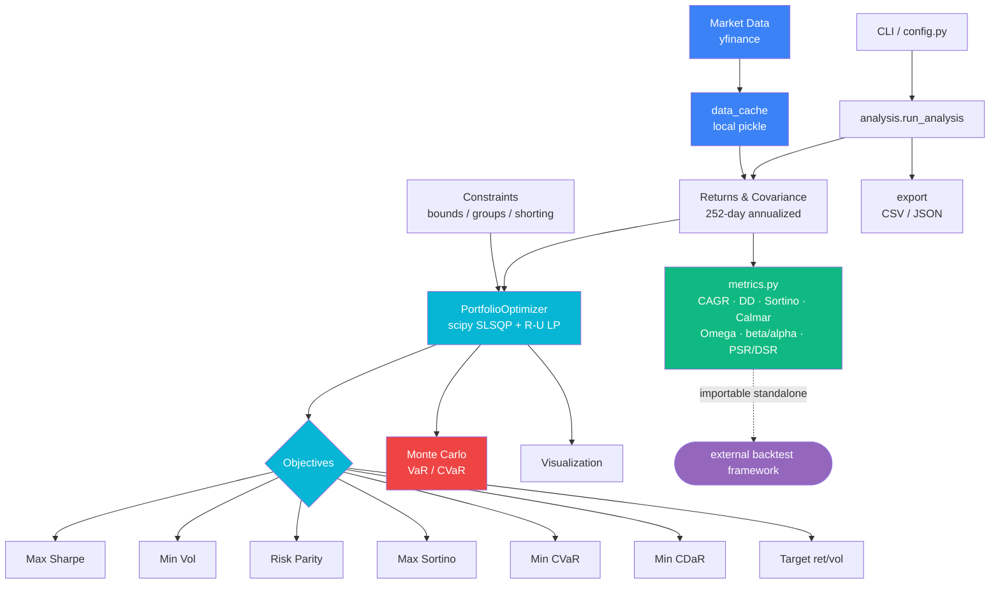

# Portfolio Optimization Engine

[](https://github.com/nicholim/quant-lab/actions/workflows/ci.yml)
[](LICENSE)
[](https://www.python.org/downloads/)
[](https://github.com/astral-sh/ruff)
[](tests/)
[](pyproject.toml)

A focused, dependency-light Modern Portfolio Theory optimizer: a true solved efficient frontier,
eight optimization objectives (incl. Hierarchical Risk Parity, min-CVaR and min-CDaR LPs),
opt-in transaction-cost-aware rebalancing, Black–Litterman views, Ledoit–Wolf
covariance shrinkage, flexible weight constraints, Monte Carlo risk projection, and a standalone
performance-metrics module — usable as a library, a CLI, or a demo HTTP API.

### Why this exists

Built on `numpy` / `pandas` / `scipy` only (no `cvxpy` solver stack), the engine stays small
and easy to read while covering the objectives most asset-allocation work needs. Its
`metrics` module is deliberately I/O-free and importable on its own, which is why the sibling
[`backtesting-framework`](../backtesting-framework) depends one-way on this package
(`OptimizationRebalanceStrategy` drives the optimizer; Sharpe/Sortino/drawdown definitions are
a shared source of truth). It is a clear MPT reference implementation and a teaching-grade
codebase, not an institutional solver framework. See ["vs. the popular tools"](#vs-the-popular-tools).

## Architecture



## Features

- **Efficient Frontier** — both a Dirichlet random-portfolio **cloud** (`efficient_frontier`, for the scatter background) and the **true solved frontier** (`solved_efficient_frontier`), which sweeps the min-volatility-at-target-return solve across a return grid to trace the actual convex boundary
- **Ledoit–Wolf covariance shrinkage** — opt-in (`calculate_returns(shrinkage="constant_correlation" | "identity")`, default **off** for parity), shrinks the noisy sample covariance toward a structured target with the analytically optimal intensity (numpy only, no scikit-learn)
- **Robust moment estimators** — opt-in named covariance estimators (`calculate_returns(cov_estimator=...)`): **EWMA/RiskMetrics**, **OAS shrinkage** (Chen et al. 2010 closed form), and **Marchenko–Pastur eigenvalue denoising** (trace- and PSD-preserving); plus expected-return estimators (`mean_estimator=...`): **EWMA** and **positive-part James–Stein** shrinkage toward the grand mean. Defaults (`"sample"`/`None`) stay byte-identical to `returns.cov()*252` / `returns.mean()*252` (numpy only, no scikit-learn). Also wired to the CLI (`--cov-estimator`/`--mean-estimator`), the FastAPI `/optimize` body, and the Streamlit UI
- **Risk attribution** — `risk_attribution(weights, groups=None)` returns an Euler decomposition of portfolio volatility (`weight`, marginal `mcr`, component `ccr`, and `pct_risk`); component contributions sum to σ_p and `pct_risk` sums to 1. Optional sector/group rollup. Surfaced in the console report, the `POST /risk-attribution` endpoint, and a Streamlit "Risk attribution" panel (grouped bar: % risk vs % weight)
- **Black–Litterman expected returns** — opt-in, blends the market-implied equilibrium prior (reverse optimization `Π = δ Σ w_mkt`) with investor views `P·E[R] = Q` (uncertainty `Ω`, default `diag(τ P Σ Pᵀ)`) via the BL master formula. Use `black_litterman_returns(P, Q, ...)` for the posterior vector, or `optimize_black_litterman(P, Q, ...)` to max-Sharpe on the posterior. With no views the posterior equals the equilibrium prior (numpy only, no PyPortfolioOpt/cvxpy)
- **Multiple optimization objectives:**
  - **Max Sharpe** — tangency portfolio maximizing risk-adjusted return (SLSQP)
  - **Min Volatility** — global minimum variance portfolio
  - **Risk Parity** — equalizes each asset's risk contribution
  - **Hierarchical Risk Parity (HRP)** — López de Prado's solver-free, correlation-clustering allocation (`optimize_hrp()`)
  - **Max Sortino** — maximizes return per unit of downside deviation
  - **Min CVaR** — minimizes historical expected shortfall via the Rockafellar–Uryasev linear program
  - **Min CDaR** — minimizes Conditional Drawdown-at-Risk (the mean of the worst-tail drawdowns) via a Chekhlov–Uryasev–Zabarankin LP (`optimize_min_cdar(confidence=0.95)`). Uses the **uncompounded** cumulative-return path (`cumsum`) to keep the LP linear; this arithmetic drawdown is *related but not equal* to the geometric (`cumprod`) max drawdown in `metrics.py` that the backtester reports
  - **Target-based** — max return for a target volatility, or min volatility for a target return
- **Flexible constraints** — per-asset and per-group min/max weight bounds, optional shorting
- **Transaction-cost-aware rebalancing** (opt-in) — pass `current_weights` (the prior allocation, array or ticker-dict) plus `transaction_cost` (scalar or per-asset per-unit-turnover cost) to the SLSQP objectives (`optimize_sharpe`, `optimize_min_volatility`, `optimize_sortino`, and the two target-based solves) to penalize `|w − w_prev|` (L1 turnover). Defaults (`current_weights=None`, `transaction_cost=0.0`) leave every result byte-identical to the cost-free optimum. A backtester could pass its prior rebalance weights to penalize churn between rebalances (no changes to the backtesting package required)
- **Performance metrics** — CAGR, max drawdown, Sortino, Calmar, Omega, plus beta/alpha vs a benchmark, and the **Probabilistic & Deflated Sharpe Ratio** (`probabilistic_sharpe_ratio`, `deflated_sharpe_ratio`; Bailey & López de Prado) — closed-form, scipy-free, importable standalone so the backtester applies the DSR multiple-testing correction to its parameter sweeps
- **Monte Carlo Simulation** — Project portfolio value using geometric Brownian motion with VaR and CVaR estimation
- **Result export** — write results and metrics to CSV / JSON for downstream tools (e.g. a backtest framework)
- **Correlation, weights, drawdown & returns visualizations**

## Technical Highlights

- **Mathematically correct** — Proper Itô calculus formulation for GBM drift term `(μ - ½σ²)dt`, annualized covariance via 252 trading-day convention
- **Constrained optimization** — SLSQP with weight-sum and non-negativity constraints, convergence validation on every solve
- **Reproducible results** — All random processes accept `random_state` parameter for deterministic backtesting
- **VaR & CVaR** — Both parametric risk measures computed from full simulation distribution, not approximation
- **Dirichlet sampling** — Efficient frontier uses Dirichlet distribution to guarantee valid portfolio weights (sum to 1, all non-negative)

## vs. the popular tools

Honest positioning against the well-known Python portfolio libraries. Capabilities below
reflect each project's documented behavior — this engine intentionally does **less** than the
big frameworks, but stays small, readable, and dependency-light.

| Capability | **This engine** | PyPortfolioOpt | riskfolio-lib | skfolio | cvxpy |
|---|:---:|:---:|:---:|:---:|:---:|
| Max Sharpe / min volatility | Yes | Yes | Yes | Yes | DIY |
| Risk parity | Yes (equal risk contribution) | HRP only | Yes (RP + HRP/HERC) | Yes (RP + clustering) | DIY |
| Hierarchical Risk Parity (HRP) | Yes (solver-free, `optimize_hrp`) | Yes | Yes (HRP + HERC) | Yes | DIY |
| Sortino / semivariance | Yes (max Sortino) | Yes (semivariance frontier) | Yes | Yes | DIY |
| CVaR / expected shortfall | Yes (Rockafellar–Uryasev LP) | Yes (`EfficientCVaR`) | Yes (many tail measures) | Yes | DIY |
| CDaR / drawdown-at-risk | Yes (Chekhlov–Uryasev–Zabarankin LP, `optimize_min_cdar`) | No | Yes (`EfficientFrontier`-style DaR/CDaR) | No | DIY |
| Transaction-cost / turnover-aware rebalancing | Yes (opt-in L1 turnover penalty on SLSQP objectives) | Yes (`add_objective` L1/L2) | Yes | Yes | DIY |
| Per-asset & group weight bounds, shorting | Yes | Yes | Yes | Yes | DIY |
| Black–Litterman / factor / clustering models | Black–Litterman + HRP | Black–Litterman | Extensive | Extensive (sklearn estimators) | DIY |
| Walk-forward / purged cross-validation | No | No | Limited | Yes (its headline feature) | No |
| Monte Carlo VaR/CVaR projection | Yes (GBM) | No | No | No | No |
| Solver stack | scipy `SLSQP` + `linprog` | cvxpy | cvxpy | cvxpy | (is the solver) |
| Core dependencies | numpy/pandas/scipy | + cvxpy | + cvxpy | + sklearn/cvxpy | cvxpy |

**What this engine does well:** a compact, readable MPT reference — eight objectives (incl.
Hierarchical Risk Parity, an empirical-CVaR LP and an empirical-CDaR LP), flexible constraints,
opt-in transaction-cost (turnover) aware rebalancing, Black–Litterman views,
opt-in Ledoit–Wolf shrinkage, and a self-contained `metrics` + Monte Carlo layer with no heavy
solver dependency. It draws **both** a Dirichlet random-portfolio cloud (`efficient_frontier`,
for the scatter background) **and** the true swept convex boundary (`solved_efficient_frontier`,
min-vol-at-target-return across a return grid).

**What it intentionally does not do:** factor models, machine-learning covariance/return
estimators, or leakage-safe cross-validation. For those, reach for
[`riskfolio-lib`](https://github.com/dcajasn/Riskfolio-Lib) or
[`skfolio`](https://github.com/skfolio/skfolio); for a battle-tested classical toolkit, see
[`PyPortfolioOpt`](https://github.com/robertmartin8/PyPortfolioOpt); to hand-roll arbitrary convex
objectives, use [`cvxpy`](https://www.cvxpy.org/) directly.

**Who it's for:** anyone who wants a transparent MPT implementation to read, extend, or embed
(e.g. as the rebalancing engine behind a backtester) without pulling in a full convex-solver
stack. For ecosystem context, see [`awesome-quant`](https://github.com/wilsonfreitas/awesome-quant).

## Tech Stack

- **Python 3.10+**
- **pandas** — Data manipulation and time series
- **NumPy** — Numerical computations
- **scipy** — Constrained optimization (SLSQP)
- **matplotlib / seaborn** — Visualization
- **yfinance** — Historical market data

## Quick Start

```bash
git clone https://github.com/nicholim/quant-lab.git
cd portfolio-optimization-engine

python -m venv venv
source venv/bin/activate  # Windows: venv\Scripts\activate

pip install -r requirements.txt
pip install -e .            # makes the package importable from anywhere

python main.py              # full analysis on the default tickers (needs network)
python examples/quickstart_offline.py     # runnable end-to-end, no network
python examples/black_litterman_demo.py    # prior → view → posterior → weights, no network
```

The offline example ([`examples/quickstart_offline.py`](examples/quickstart_offline.py)) injects
a synthetic returns matrix and walks the full workflow — all six objectives, the efficient
frontier, the metrics module, and a Monte Carlo VaR/CVaR projection — without any Yahoo Finance
call, so it always reproduces. The Black–Litterman example
([`examples/black_litterman_demo.py`](examples/black_litterman_demo.py)) shows the full
prior → bullish-view → posterior → optimized-weights flow (also offline).

## Command-line usage

`main.py` is a thin CLI over `run_analysis`. Inputs are configurable via flags
(or a JSON config file); flags override file values.

```bash
# Run every objective, compute beta/alpha vs SPY, export CSV+JSON, skip plots
python main.py \
  --tickers AAPL MSFT JPM \
  --start-date 2021-01-01 --end-date 2023-01-01 \
  --objective all --benchmark SPY \
  --export-format both --no-plots

# From a config file
python main.py --config my_run.json
```

Key flags: `--objective {sharpe,min_vol,risk_parity,sortino,min_cvar,min_cdar,hrp,both,all}`,
`--benchmark TICKER`, `--export-format {csv,json,both,none}`, `--output-dir`,
`--num-portfolios`, `--risk-free-rate`, `--random-state`, `--no-plots`, `--offline`.

> **Black–Litterman is not a `--objective`.** It needs investor *views* (a pick
> matrix `P` and target returns `Q`), which don't fit the flat CLI. Use the library
> API (`optimize_black_litterman(P, Q, ...)`), the FastAPI `POST /optimize/black-litterman`
> endpoint, or the runnable [`examples/black_litterman_demo.py`](examples/black_litterman_demo.py)
> (prior → view → posterior → weights, fully offline).
Exports are written to `--output-dir` (default `results/`, gitignored).

### Resilient data layer (cache / retry / offline)

All network access lives in one place — `portfolio_optimization_engine/data_cache.py`.
Both the optimizer's price fetch and the analysis layer's benchmark fetch route through
`fetch_close_prices`, which adds, on top of the existing on-disk pickle cache (primary;
keyed by tickers/dates, overridable via `POE_CACHE_DIR`):

- **Retry + exponential backoff** on transient / rate-limit / timeout errors from yfinance.
- A typed `MarketDataError` on final failure (no raw network exception leaks out).
- A **graceful offline fallback**: pass `--offline` (CLI), `offline=True` (library), or set
  `PORTFOLIO_OFFLINE=1` to serve a small bundled price fixture
  (`portfolio_optimization_engine/data/sample_prices.csv`, tickers
  `AAPL/MSFT/GOOGL/AMZN/JPM/GS/SPY`) instead of hitting the network — so demos never hard-fail on
  restricted cloud egress. The fixture covers the CLI's **default** ticker universe, so
  `python main.py --offline` runs end-to-end with no `--tickers` needed. Offline results are not
  written to the on-disk cache.

```bash
# Fully offline demo (no network) — default universe, no --tickers needed
python main.py --offline --no-plots
# Or pick a subset + a benchmark from the fixture (beta/alpha vs SPY)
python main.py --tickers AAPL MSFT GOOGL --benchmark SPY --offline --no-plots
```

## Example Output

```
============================================================
Portfolio Optimization Engine
============================================================

Fetching data for AAPL, GOOGL, MSFT, AMZN, JPM, GS...
Generating efficient frontier (5000 portfolios)...
Optimizing portfolios...

------------------------------------------------------------
MAX SHARPE RATIO PORTFOLIO
------------------------------------------------------------
  Expected Return:  28.01%
  Volatility:       30.02%
  Sharpe Ratio:     0.87
  Weights:
    AAPL  : 53.63%
    AMZN  : 12.42%
    GS    : 33.96%

------------------------------------------------------------
MINIMUM VOLATILITY PORTFOLIO
------------------------------------------------------------
  Expected Return:  20.77%
  Volatility:       27.25%
  Sharpe Ratio:     0.69

Running Monte Carlo simulation (10,000 paths)...

  1-Year VaR (95%):  $22,528
  1-Year CVaR (95%): $31,335
```

## Usage

```python
from portfolio_optimization_engine.optimizer import PortfolioOptimizer
from portfolio_optimization_engine.monte_carlo import MonteCarloSimulator

# Initialize optimizer with tickers and date range
optimizer = PortfolioOptimizer(
    tickers=["AAPL", "GOOGL", "MSFT", "JPM", "GS"],
    start_date="2020-01-01",
    end_date="2024-01-01",
    risk_free_rate=0.02,
)
optimizer.fetch_data()
optimizer.calculate_returns()

# Generate the random-portfolio cloud (scatter background)
frontier = optimizer.efficient_frontier(num_portfolios=5000)

# ...or the TRUE solved frontier (min-vol per target return, sorted by return)
solved = optimizer.solved_efficient_frontier(n_points=50)

# Optional: Ledoit-Wolf covariance shrinkage (default off; off == byte-identical
# to the plain sample covariance, preserving metrics/backtester parity)
optimizer.calculate_returns(shrinkage="constant_correlation")
print(optimizer.shrinkage_intensity)  # chosen intensity in [0, 1]

# Find optimal portfolios — every objective shares the same constraint kwargs
max_sharpe = optimizer.optimize_sharpe()
min_vol = optimizer.optimize_min_volatility()
risk_parity = optimizer.optimize_risk_parity()
hrp = optimizer.optimize_hrp()  # Hierarchical Risk Parity (no solver, long-only)
sortino = optimizer.optimize_sortino()
min_cvar = optimizer.optimize_min_cvar(confidence=0.95)
min_cdar = optimizer.optimize_min_cdar(confidence=0.95)  # Conditional Drawdown-at-Risk (LP)

# Transaction-cost-aware rebalancing (opt-in; SLSQP objectives only).
# Penalize L1 turnover from a prior allocation; defaults (None / 0.0) = unchanged.
prior = {"AAPL": 0.5, "MSFT": 0.3, "GOOGL": 0.2}
rebalanced = optimizer.optimize_sharpe(current_weights=prior, transaction_cost=0.5)

# Black-Litterman: blend the equilibrium prior with investor views.
# A bullish absolute view that asset 0 returns 15% annually:
import numpy as np
P = np.array([[1.0, 0.0, 0.0]])  # pick matrix: one row per view
Q = np.array([0.15])             # view returns
posterior = optimizer.black_litterman_returns(P, Q)  # pandas Series per ticker
bl = optimizer.optimize_black_litterman(P, Q)        # max-Sharpe on the posterior
# With no views, the posterior equals the equilibrium prior Pi = delta * Sigma @ w_mkt
prior = optimizer.black_litterman_returns()          # equal-weight neutral prior

# Flexible constraints: cap AAPL at 30%, limit a tech group to 50%, allow shorting
constrained = optimizer.optimize_sharpe(
    max_weights={"AAPL": 0.30},
    groups={"tech": (["AAPL", "MSFT"], 0.0, 0.50)},
)

# Target-based optimization
risk_budgeted = optimizer.optimize_max_return_target_vol(target_vol=0.20)

print(f"Max Sharpe: Return={max_sharpe.expected_return:.2%}, Vol={max_sharpe.volatility:.2%}, Sharpe={max_sharpe.sharpe_ratio:.2f}")

# Standalone performance metrics (importable by a separate backtest framework)
from portfolio_optimization_engine.metrics import compute_metrics
from portfolio_optimization_engine.analysis import compute_portfolio_returns

daily = compute_portfolio_returns(optimizer.returns, max_sharpe.weights)
m = compute_metrics(daily, risk_free_rate=0.02)
print(f"CAGR={m.cagr:.2%}, MaxDD={m.max_drawdown:.2%}, Sortino={m.sortino_ratio:.2f}, Calmar={m.calmar_ratio:.2f}")

# Monte Carlo simulation on optimal portfolio
mc = MonteCarloSimulator(
    expected_return=max_sharpe.expected_return,
    volatility=max_sharpe.volatility,
    initial_value=100_000,
)
mc.simulate(num_simulations=10_000, num_days=252)
print(f"VaR 95%: ${mc.calculate_var(0.95):,.0f}")
print(f"CVaR 95%: ${mc.calculate_cvar(0.95):,.0f}")
```

## Project Structure

```
portfolio-optimization-engine/
├── main.py                 # Thin CLI wrapper (parse args → run_analysis → report/export/plot)
├── pyproject.toml          # Installable package (pip install -e .)
├── requirements.txt
├── requirements-api.txt    # Extra deps for the optional FastAPI demo (adds to requirements.txt)
├── api/app.py              # Thin FastAPI demo wrapper (calls the public API; no logic duplicated)
├── render.yaml             # Render Blueprint for the FastAPI demo
├── examples/               # Runnable workflows (quickstart_offline.py, black_litterman_demo.py — no network)
├── streamlit_app.py        # Streamlit demo UI (input sources, 9 objectives, frontier, Black-Litterman form)
├── tests/                  # pytest suite (327 tests, ~96% coverage)
└── portfolio_optimization_engine/   # importable package
    ├── optimizer.py         # PortfolioOptimizer (frontier, all objectives, flexible constraints)
    ├── covariance.py        # Ledoit-Wolf shrinkage estimators (opt-in, numpy-only)
    ├── black_litterman.py   # Black-Litterman prior + posterior (opt-in, numpy-only)
    ├── data_cache.py        # On-disk price cache (avoids repeat yfinance downloads)
    ├── monte_carlo.py       # MonteCarloSimulator (GBM, VaR, CVaR)
    ├── metrics.py           # Standalone performance metrics (CAGR, drawdown, Sortino, Calmar, …)
    ├── config.py            # AnalysisConfig + argparse CLI + JSON config
    ├── analysis.py          # run_analysis orchestration + console report
    ├── export.py            # CSV / JSON result export
    └── visualization.py     # Plotting (frontier, correlation, weights, returns, drawdown)
```

## Web UI (Streamlit)

`streamlit_app.py` is an interactive demo surface that makes the optimizer usable
without the CLI. It is a *demo only* — it never reimplements the optimization
math; every result flows through the existing public API (the same
injected-returns contract the backtester and FastAPI demo use), so the
cross-package contract stays intact.

```bash
streamlit run streamlit_app.py
# or from the monorepo root:  make run-optimizer-ui
```

What it shows:

- **Input source** — bundled offline sample, uploaded/entered returns, or a live
  yfinance fetch.
- **9 objectives** — max Sharpe, min volatility, risk parity, HRP, max Sortino,
  min CVaR, min CDaR, and the two target-based solves, plus an "All objectives" comparison.
- **Efficient frontier** — the true *solved* frontier
  (`solved_efficient_frontier`), not just the random-portfolio cloud.
- **Black-Litterman mini-form** — enter views (pick matrix `P` + target returns
  `Q`) and see prior → posterior → optimized weights.

**Offline behavior:** it works fully offline using the bundled price fixture
(`portfolio_optimization_engine/data/sample_prices.csv`) and degrades gracefully
(never a raw traceback) when a live fetch fails. The `.streamlit/config.toml`
theme is committed. This file lives outside the `src` coverage scope (like
`api/` and `main.py`), so it is AppTest-exercised without diluting the package
coverage gate.

## Deploy (Render) — optional FastAPI demo

A thin, optional FastAPI wrapper (`api/app.py`) exposes the optimizer as a demo
HTTP API. It does **not** change the library or CLI — it only *calls* the existing
`PortfolioOptimizer` public API, so the cross-repo contract is unaffected.

Endpoints:

| Method | Path          | Purpose                                                       |
|--------|---------------|---------------------------------------------------------------|
| GET    | `/health`     | Liveness probe (Render health check).                         |
| GET    | `/objectives` | List supported objectives.                                    |
| POST   | `/optimize`   | Body: `{tickers, returns (T×n daily), objective, risk_free_rate}` → weights + metrics. |
| POST   | `/optimize/black-litterman` | Body: `{tickers, returns, views[], market_weights?, tau, risk_aversion}` → weights + posterior/prior returns. |

Supported `/optimize` objectives: `sharpe`, `min_volatility`, `risk_parity`,
`sortino`, `min_cvar`, `min_cdar`, `hrp`. The `/optimize` body also accepts optional
`current_weights` (ticker→prior weight) + `transaction_cost` for turnover-aware
rebalancing on the SLSQP objectives (`sharpe`/`min_volatility`/`sortino`); both absent
leaves the result unchanged. **Black–Litterman** has its own endpoint because it
takes investor *views*: each view is `{assets: {ticker: loading}, q, confidence?}`
(absolute or relative). With no views the optimization runs on the market-implied
equilibrium prior; the response echoes both the `prior_returns` and the
view-adjusted `posterior_returns`.

Run locally:

```bash
pip install -r requirements-api.txt && pip install -e .
uvicorn api.app:app --reload          # docs at http://127.0.0.1:8000/docs
```

Deploy on Render (Blueprint — `render.yaml` is committed):

1. Push this repo to GitHub.
2. Render dashboard → **New → Blueprint** → select this repo. Render reads `render.yaml`:
   - build: `pip install -r requirements-api.txt && pip install -e .`
   - start: `uvicorn api.app:app --host 0.0.0.0 --port $PORT`
   - health check: `/health`, free plan, `autoDeploy: false` (deploy on demand).
3. Click **Apply** to create the service. No secrets/env vars are required (the demo
   takes returns in the request body, so no Yahoo Finance / network access is needed).

## Testing & quality

```bash
pip install -e ".[test]"
pytest                       # 327 tests, branch coverage gated at 90% (~96% actual)
ruff check . && ruff format --check .
```

The suite (`tests/`) covers the optimizer objectives, all constraint shapes
(per-asset/group bounds, shorting, target vol/return feasibility), degenerate/singular-covariance
inputs, the config/CLI/JSON precedence, export, and Monte Carlo guards. Two contracts are
explicitly test-enforced rather than benchmarked against an external library:

- **Metrics parity** — `metrics.py` (Sharpe/Sortino/drawdown/…) is the shared source of truth with
  the sibling `backtesting-framework`; `tests/test_optimizer_edge.py` asserts the optimizer's
  inline statistics agree with the standalone `metrics` functions.
- **Injected-returns API contract** — the exact pattern the backtester and the FastAPI demo use
  (`set .returns/.mean_returns/.cov_matrix → optimize_*`) is covered, so the public API the
  downstream repo imports cannot drift silently.

See [`CONTRIBUTING.md`](CONTRIBUTING.md) for the full dev setup, commit conventions, and PR checklist.

## License

MIT
